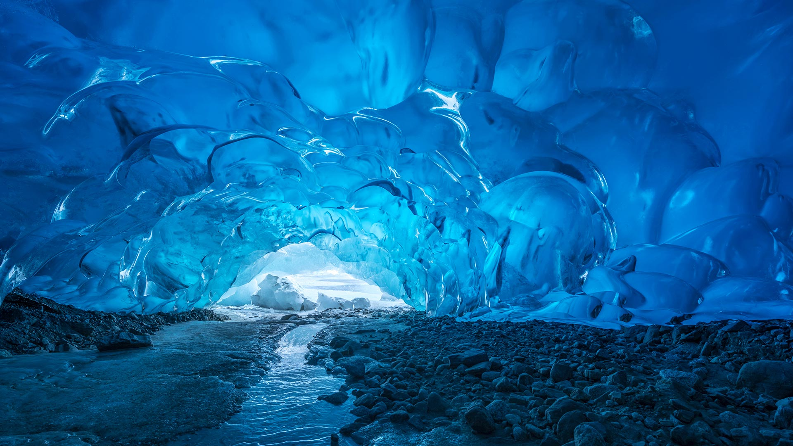

# 冰，由内而外透出光芒
在阿拉斯加门登霍尔冰川的冰洞内，幽蓝的光线如灵韵的呼吸，由内而外漾出神秘又璀璨的光芒。冰墙以深邃的青蓝色为底色，每一道纹理都似自然鬼斧雕琢的音符，光影在冰面起伏时，更像流动的诗篇，将冷寂与柔和揉成温柔的液态色泽。冰的通透质感如水晶，却又承载着千万年寒力的沉淀，幽蓝的光在冰层罅隙间跳跃，编织出一片静谧的空间。地面的小溪如银链，于碎石间蜿蜒，为这冰晶宫殿增添了一抹灵动的韵律。  

这片冰洞是时光熬煮的奇迹，冰川的形成源于千年的冻融与迁徙，承载着自然馈赠的纯粹艺术。阿拉斯加的极地地理背景让冰川成为地理奇观，而冰洞的存在，既是自然以冰为笔绘就的画卷，也见证了生态变迁的脉络。当光穿透冰层时，冰由内而外透出的光芒，恰似自然向世人传递的心跳——那是千万年寒力的诗，也是大地生态的注脚。在冰洞内，人们能触摸到冰川的历史，感受到极地生态的温度，更读懂自然造化的智慧与沧桑。这片冰洞，是自然与人文对话的圣地，是地球生命故事的璀璨缩影。