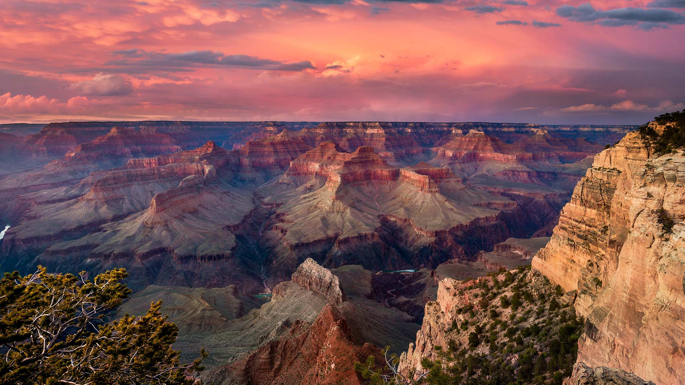

# 一幅壮丽的景象  
当黄昏的霞光为大地晕染出一抹绮丽的注彩时，大峡谷以它磅礴的生命力舒展着恢弘的轮廓。画面里，光影如灵动的笔触，在层峦叠嶂的峡谷上肆意挥洒。余晖为岩石镀上暖金，部分崖壁被阴影裹挟成深棕，而天空则被粉紫的云霞铺展成梦幻的天空画布，色彩在天地间层层晕染，红橙交织、紫灰相融，如同一首由大地书写的史诗，每一道纹理都在诉说千万年的时间故事。  

构图上，全景的深远让视线无数次追逐峡谷的纵深，从近处的岩壁错落的纹理，到远方的层峦叠嶂，每一处都有自然的韵律。科罗拉多河如银线滑过谷底，为这宏伟的峡谷注入了灵动的气息，河流的幽蓝与崖壁的土褐形成鲜明的色彩对比，更添画面的层次与生机。  

大峡谷的壮丽，是自然与时间的杰作。科罗拉多河经过千万年的冲刷，雕琢出这地质奇观，层层的岩壁是地球历史的活化石，记录着气候变迁与地壳运动的痕迹。而在这壮阔景观背后，是深厚的人文底蕴：原住民部落世代于此居住，将自然视为神圣的家园，其文化根脉与峡谷的沧桑相拥相融；后来者则在此追寻着心灵的震撼与科学的探索，大峡谷成为人类理解自然、敬畏生命的历史见证。  

当光影、色彩与地质文化在此交汇，一幅壮丽的景象便成为永恒的注脚，诉说时光与土地的深情对话，也承载着人类心中对壮美与真理的向往。