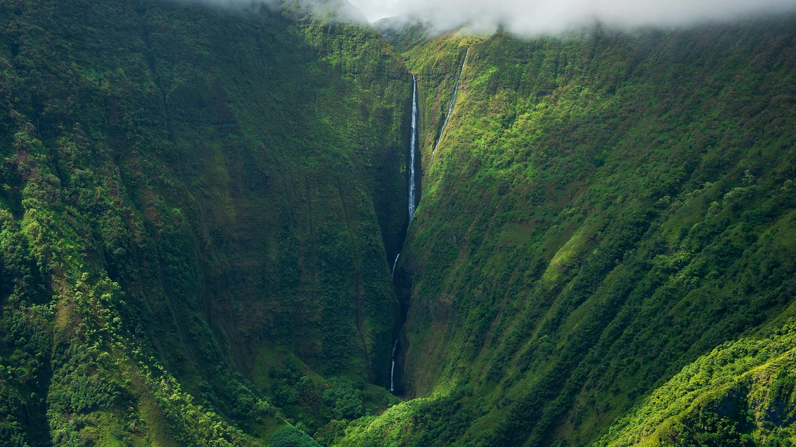

# 溢溢着社区氛围

在莫洛凯岛的奥洛乌佩纳瀑布附近，一道被葱郁山峦环抱的峡谷骤然觉醒。山峦似被时光打磨的巨画，以深浅交织的翠绿铺展天地，从深苔般的黛绿到草尖迸发的明翠，每一层绿意都藏着自然的呼吸。薄云如轻纱轻笼峰顶，阳光借薄雾的缝隙洒下，给山壑绘上明暗交错的脉络。瀑布如银线悬于峡谷中央，水流以洁净的光泽穿梭而下，与周围吸纳阳光的绿植形成绝妙对比——银白与翠绿在空气中晕开，构成一幅鲜活的生命图谱。画面构图以峡谷为框架，瀑布垂直而下，天地之间被绿色环抱又由瀑布撕开一道光亮的缺口，形成动静相生的美。  

这处秘境与莫洛凯岛社区的文化脉络紧密相连。波利尼西亚部落在千年里与山谷相依，视瀑布为山的眼睛、绿植为血脉，在共生中塑造了独特社区精神。当地民众将自然视为家园延伸，守护山谷与瀑布如同守护亲友。当游客踏入此地，亦走进了自然与人文交融的社区图景——村民的热情、对生态的敬畏、与山水共生的生活姿态，都在瀑布水雾和山风叶隙中传递。这绝非孤立自然景观，而是社区生活与历史地理的交融，是文化与自然共同的诗行。社区氛围在此是人与山水、传统深度共鸣的体现，每一道光影都藏着社区的生命力量，每一片绿叶都映着文化与自然的微笑，让这片山谷不仅有自然震撼，更有人文温度与社区温情。