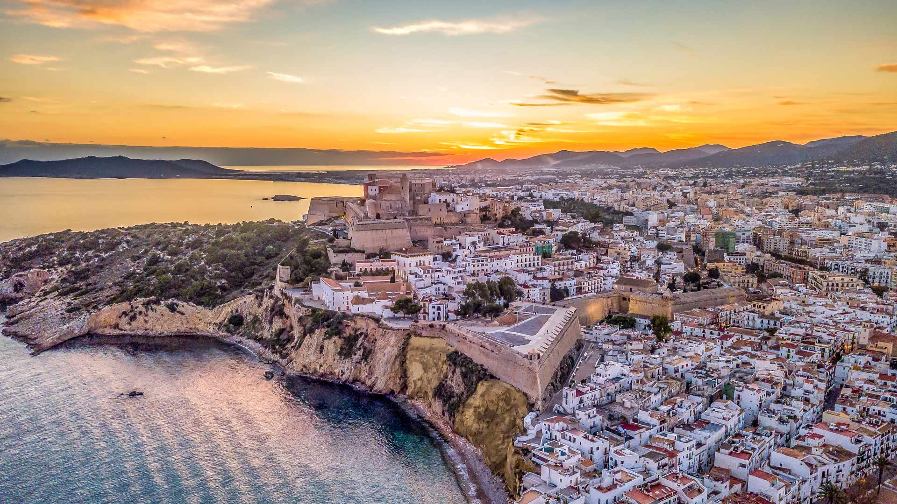

# 每一步，都是传承

当夕阳为天地晕染成暖金与橙红交织的画卷时，伊维萨岛的轮廓在光影中静静舒展。从高空俯瞰，古城如一颗镶嵌山海间的璀璨珍珠，白色墙面在晚照下漾着温润的光晕，与靛蓝海水、崖壁的黄褐与苍绿相互映衬，山海色彩与建筑色调交织成一幅自然的调色盘。天空的橙黄与淡粉渐变如流动的锻金，为整个海岛蒙上一层诗意滤镜，光线似温柔的手，轻抚古城每一寸墙面，将历史底蕴悄然晕开。

古城的布局宛如一部立体的历史课本，古老城堡雄踞峰顶，如同岁月的守望者；密集的民居依山势错落而建，仿佛时光在此处留下的肌理，每座建筑都藏着世代相传的印记。海岸边的崖壁陡峭而苍劲，黄褐色与青绿色交织，海水在风里漾起蓝绿色的涟漪，如时光流淌的痕迹，将自然与人文紧紧相连。

伊维萨岛是巴利阿里群岛的文化与地理瑰宝，这片土地承载着千年的文明脉络——从古罗马遗迹到中世纪防御工事，从摩洛哥文化与基督教文明的交融，到如今鲜活的人文气息，每一步行走皆为传承的注脚。建筑与山海的融合，是文明迭代与传承的鲜活写照。当暮色漫过海湾，岛屿在光影中沉淀，我们看见的，是自然与人文共同编织的传承之网，将岛屿的过往与当下，温柔系在每缕海风、每一步足音与每一道历史墙垣中。每一步，都是文明延续的足迹，也是山海共谱的乐章。