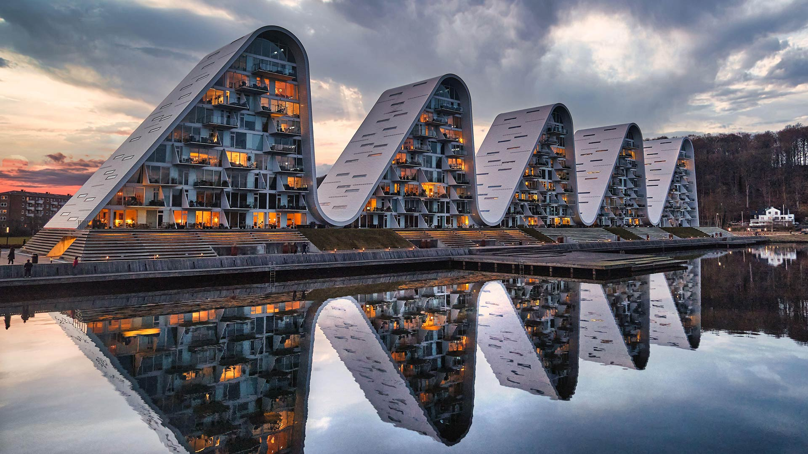

# 混凝土中铸造的波浪

当暮色如丝带般在三明治天际铺展，瓦埃勒的波浪住宅楼正以混凝土语言与自然对话。建筑如翻涌的浪涛，一道道弧线在暮光里漾开冷暖交织的韵律。光影在混凝土与玻璃之间流转，暖黄的灯光从窗棂倾泻而出，于冷调的外墙形成温柔光斑；天空中灰与橙的云层，将最后一抹斜辉泼洒在曲线轮廓，让建筑在光影中愈发柔和。  

构图上，波浪形建筑依次排开，如自然迸发的肌理，又以现代建筑的秩序筑就韵律。水面如镜，将这组“混凝土波浪”复刻为对称的诗行，虚实相生间，建筑与自然达成无声默契。  

此景背后，是丹麦瓦埃勒对海洋文化的诗意凝练。丹麦濒临海洋，海岸线与浪涛刻进地理与人文底色。波浪住宅楼的设计，让混凝土成为承载自然灵动的媒介——建筑形态致敬海岸浪涛，让现代居住空间成为自然景观的延伸。这种创作既是对海洋生态的致敬，也彰显丹麦文化中“建筑与自然共生”的智慧。每一道弧形藏有对海洋肌理的理解，每一扇玻璃映着自然光影，这些建筑不止是居住容器，更是地理文化与现代建筑艺术融合的璀璨注脚。它们于混凝土中铸造的波浪，是对自然之美的永恒致敬，也是北欧文化对艺术与生态敬畏与敬慕的诗性表达。