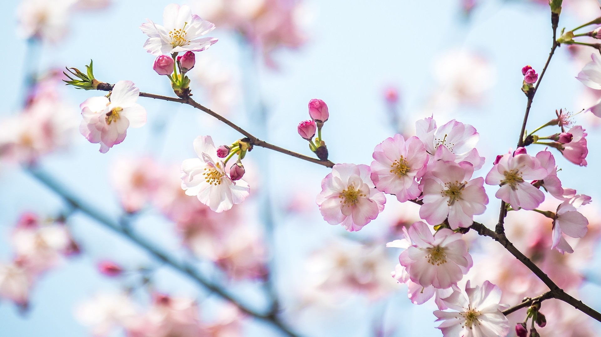

# 春日绯梦

春日的光如轻纱般笼住上海城的樱花，柔锋轻裁花瓣，将淡粉与莹白晕染成梦幻的诗行。光影在花朵上酿出温柔的涟漪，每片花瓣都似浸在暖金与柔蓝的交融里，光线顺着花蕊的方向倾泻，让粉白花瓣的层次如乐章齐奏，从初绽的娇羞到盛放的绚烂，色彩在枝头流转，构成柔和的绯色调色板。构图上以近景聚焦于舒展的枝桠，背景渐变为朦胧的晴蓝，如天然晕染的画布，让樱花成为视觉焦点，又借虚化的背景营造空灵感，将春日的轻盈与缥缈皆凝于画面。

上海，这座在江水与时光中成长的都市，春日的樱花承载着独特的地理文化记忆。较早引进的樱花，带着异域樱花的风情韵致，与上海开埠后多元的文化脉络相呼应，成为城市自然与人文交融的见证。当樱花在春日绚烂，不仅是自然季候的盛宴，更是城市精神的一次舒展：在林立的高楼间，这些绯色花瓣是自然与人文对话的温柔注脚，它诠释着人对诗意瞬间的珍视，也映照着上海在变迁中始终拥抱鲜活与温柔的品质。樱花短暂却绚烂的灵韵，在春日里成为一座城市与时光共舞的诗行，让每个过客在这绯色梦境中，触摸到自然、历史与心灵的共鸣，让春日成为城市心跳里一次关于绚烂与瞬息的狂欢。