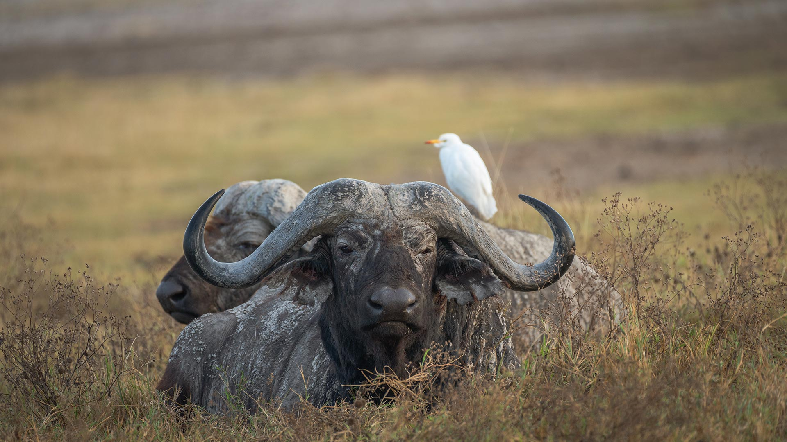

# 未驯服的精神

在恩戈罗恩戈罗火山口的草坞间，水牛如史诗般静立。柔和的光线轻笼于其皮毛，灰褐纹理中，岁月的沧桑清晰如大地刻下的史书。宽大弯曲的角似远古巨兽遗物，在光影摇曳下，既显野性的磅礴，又藏生命沉淀的矛盾美感。白色的牛鹭停伏肩头，雪亮羽饰与水牛厚重身躯形成强烈视觉反差，却以轻盈姿态，成为野性生态中共生的温婉注脚——这是自然法则里“互相成就”的诗意写照。

背景里，火山口边缘的地貌如朦胧梦境，浅黄与棕褐交织的草地，似时光轻画的水彩。恩戈罗恩戈罗作为坦桑尼亚自然瑰宝，“未被驯服的火山口”之名，恰是对这片原始生态的保护性隐喻。水牛是非洲草原血脉的传承者，角是风暴的纪念碑，皮毛是大地馈赠的铠甲，它们未驯服的精神，承载着千万年原野野性灵魂。牛鹭以共生者身份，既依附水牛皮毛发现生机，又借火山口生态庇护生存，成为自然共生的灵动环节，让生命脉络绵延长远。

这画面，是地质与生命交响的美学乐章。火山口生物在自然法则下保持本真，无人类干预痕迹，仅为野性与和谐共舞的场域。水牛凝视处是火山口秘境，白鹭伫立是共生永恒。每缕光线切割皮毛、草叶拂动兽皮的瞬间，皆成未驯服精神的世界，诉说大地与生命共同书写的史诗，让野性不再是叛逆，而是自然最深沉的底色与生命灵魂。