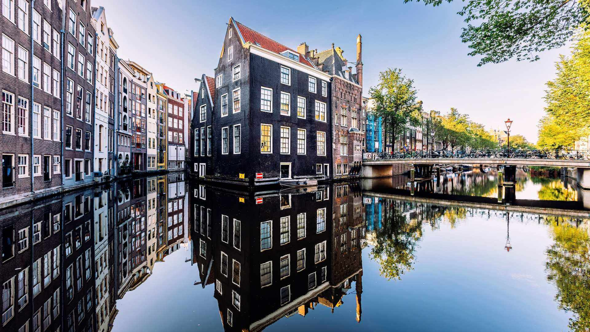

# 一次挥动桥臂，连接两岸

阳光以温柔的光刃划破阿姆斯特丹的天空，在运河水面洒下碎金般的光斑。画面里，历史建筑如一帧次第展开的调色板，黑、棕、灰、米、蓝等色交织成岁月沉淀的注脚。那些木质框架与砖石结构的古建筑，顺着运河脉络错落排列，每一栋建筑都以清晰姿态摹印在水面，仿佛与岁月达成了倒影的契约。运河如优雅的绸带蜿蜒而过，而阿姆布鲁大桥似灵动的臂弯，在两岸建筑间架起一道联结的弧线。

光影在画面中巧妙运作，蓝天是温柔的底色，树影投下斑驳褶皱，建筑檐角的阳光如撒落的宝石，将历史褶皱里的故事晕染成暖黄传奇。构图如诗，运河的对称与建筑的错落相互映衬，大桥的存在为画面注入了呼吸的弧度，仿佛每个走过桥的人，都在书写跨越时空的对话。

荷兰的运河文化是一部水与桥交织的史诗。阿姆斯特丹的城市脉络依运河铺陈，桥梁是城市的脉络与动脉，每一次桥臂的挥动，都是对地理与人文的温柔拥纳。这些运河不仅是交通枢纽，更是文化容器，承载着荷兰人民与水和谐共处的历史记忆。桥梁连接的不仅是物理上的两岸空间，更串起城市的历史记忆与生活气息：骑行者、晨雾中的水岸、古老门窗怀抱的新时光，都在桥的弧线下，成为今日与过往的纽带。

当阳光轻柔扫过建筑窗棂，倒影在水面晕开梦幻层次，桥梁成为一座连接地理与文化的桥梁，既承载流动的智慧，也为城市编织历史与当下的双重呼吸。阿姆斯特丹的每座桥梁都在重复着一个故事：以水为径、以桥为弦，让城市在低地国家的童话里，生长出属于历史脉络与当下情怀的双重生机。