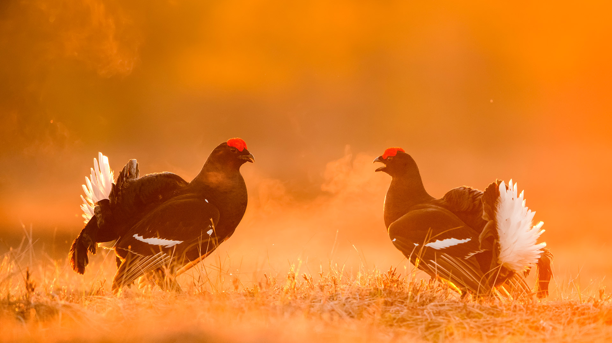

# 求偶展示场的故事  

暖金色的晨光如织锦般铺展在爱沙尼亚的草地上，两只雄性黑琴鸡站在光影交错的场域间，仿佛是自然赋予的雕塑。光影是温柔的幕布，将二者的姿态浸染成深浅交织的素描——黑色的羽毛在金光下泛着神秘光泽，鲜红的头顶如蹊径上跳动的绯色火焰，而那几抹雪白的尾羽，在光中舒展成谁也拿不走的亮色礼仪。  

构图如一本无声的乐谱，两鸟对峙的姿态成为主题，背景里朦胧的暖调渐变既柔化了现实的边界，又为这面小小的“舞台”蒙上古老仪式感。它们仰起头颅、张着喙振，羽翼下藏着更野性的部分，却此刻以生命最温柔的宣告，解读生存与繁衍的双向命题。  

这方求偶展示场，不独是黑琴鸡的世界，亦是爱沙尼亚湿地与荒原对话的千年注脚。在北欧的原野上，这样的生命剧本代代重演。当人类的注视落在这些礼赞自然生命力的场景里，保护与敬畏成为地理与人文交织的脉络。每一道光影、每一抹色彩、每一种姿态，都在诉说自然法则与生命美学的永恒奏鸣，而爱沙尼亚的草甸风，永远携着这份野性与温柔的平衡，将故事传向远方，传向所有触摸过这片大地的人们。