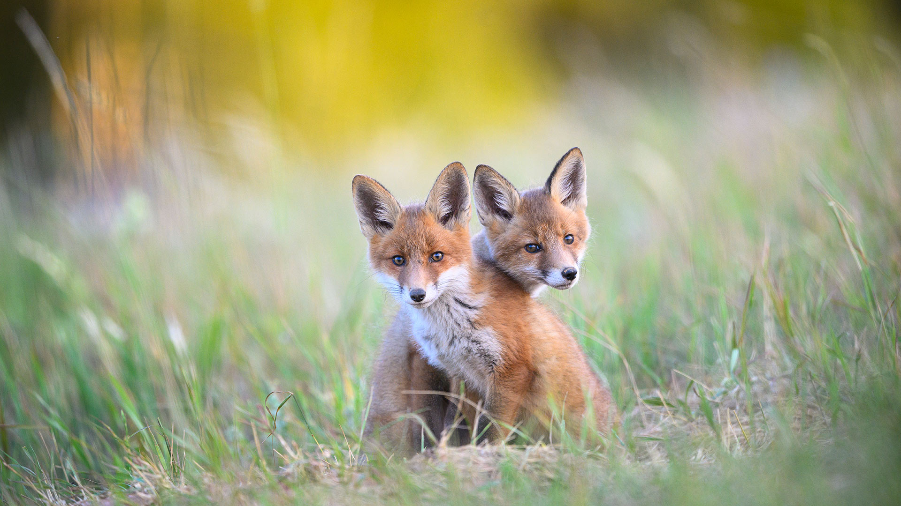

# 算计的小爪子  

阳光如轻柔的纱幕，为卡鲁拉国家公园草地上的两只幼年赤狐镀上一层暖金。柔和的光线在它们丰润的皮毛上晕开深棕与雪白的层次，像把秋日渐暖的色调轻覆在身上。两只小狐狸并肩而立，目光明亮如暮色初时的星子，神情里透着机灵与好奇，那“算计”式的神情，是自然赋予的鲜活诗意。  

它们的耳朵竖得笔直，皮毛上的每一缕纹路在光影里都化作了温柔的轮廓，背景中绿草与泛金的模糊光斑交织成朦胧的画境，让主体的灵动更显突出。风过处，草叶轻颤，为这自然写照增添了呼吸感的温柔，时光在光影里都慢了下来。  

卡鲁拉国家公园的土地，是爱沙尼亚生态保护与自然野性的见证。在这片守护自然的角落，野生动物如这两只赤狐，得以在原生环境中成长。它们的小爪子虽稚嫩，却暗藏着对世界的好奇与探索欲——在爱沙尼亚这片推崇生态平衡的土地上，它们的眼神里，既映着草叶的摇曳，也映着人与自然共生千年的人文底色。当小爪子轻触草地、目光迎接着时光时，它们在进行一场自然与生命的对话，而这场对话，正是卡鲁拉国家公园守护生态、传承自然智慧的文化注脚。它们的面庞与小爪，是野性之美的缩影，更是土地与生命和谐共生的诗行，在自然的脉络里续写着人与万物共生的永恒篇章。