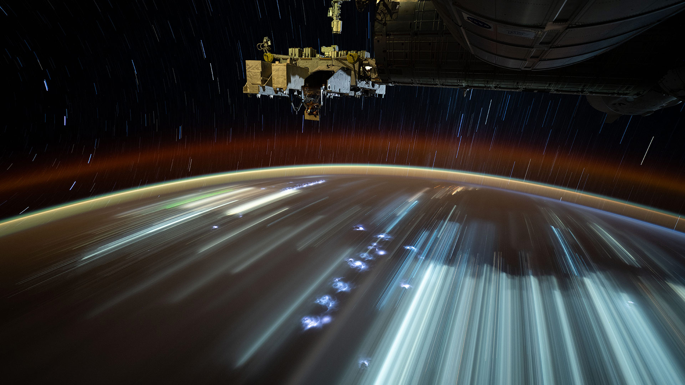

# 离开地球的第一步

当目光穿透国际空间站的视野，那幅景致如梦境般铺展。深邃的太空似黑丝绒，点缀着星轨细密的银线，如时间凝练的轨迹从地平线向天际蔓延。地球边缘晕染着暖金与靛蓝的渐变，大气层的薄纱将阳光柔成一道光带——这是地球向太空献上的温柔界定，既藏着蓝绿绒毯般的生命气息，又裹挟着人类在暗夜里点亮的光斑。下方的城市灯火如发光的星群，以流线的轨迹滑过地表，每道光迹都是人类文明与自然对话的注脚，是智慧在广袤星际下闪烁的痕迹。  

空间站结构的金属机械于黑暗中泛着冷光，复杂的仪器与组件，是人类在未知中探索的刻痕，是技术与宇宙热望的交融。此际，地球从脚下的陆地，变成被太空重新审视的存在。那道光带、光的流动，在天地间的交织，织就了地理与文化的双影：地球是生命与文明的摇篮，于太空之下的轮廓愈发庄严与温柔；而空间站则为人类提供跨越地心的视角，成为文明挑战极限的见证。  

我们“离开地球的第一步”，并非抛却故土，而是以更辽阔的视角回望这片土地——它承载亿年演化，见证千年智慧，于太空之下的景致更显神圣。这一画面里的光影、色彩、构图，都是人类与地球、与太空对话的注脚，更是文明在天地间探寻自我的故事。当城市灯光在下方划过，国际空间站的视角下，地球既有熟悉的蔚蓝，又在深邃宇宙中成为可敬的存在；而人类对太空的探索，正是对自身文化、地理认知的重塑与升华，在“离开”与“回望”间，完成一场跨越时空的精神远征。