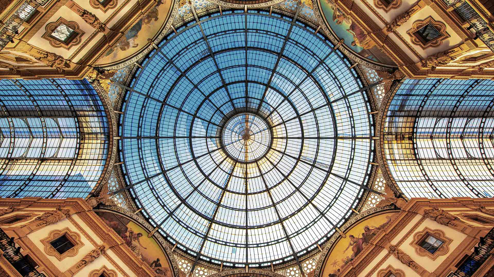

# 有格调的玻璃

当目光落向维托里奥·埃马努埃莱二世拱廊的玻璃穹顶时，时光似在光影里缓步。蓝调玻璃如澄澈的天空切片，与墙面暖金色调交织成绚烂织锦。穹顶如巨型水晶钟，由金属框架与玻璃纵横构成的海棠花式辐条，从中心向四周循环散开，每一块玻璃都滤去日光锐角，化作柔和的薄纱，在空间晕染明暗交织的抒情曲。金属框架以精巧几何韵律交织，将天空辽阔与建筑静谧编织为巨大穹幕，整个构图是圆的交响——从中心辐向四周的线条，将天空纳入躯体，又以温度暖化工业时代的冷硬结构。  

这片玻璃穹顶，是19世纪意大利热情的注脚。维托里奥·埃马努埃莱二世拱廊是米兰商业与文化的盛宴，玻璃穹顶诞生于工业革命下艺术与技术的碰撞。工匠以玻璃为画布、金属为笔触，镌刻米兰繁荣与贵族优雅。从地理维度看，这里是意大利商业精神中心，拱廊作为步行街典范，玻璃穹顶既引入自然光，也是建筑与自然对话的具象化——光经玻璃过滤，成为历史与空间的纽带。每一道透光缝隙，都承载历史回声：19世纪米兰以建筑艺术化定义消费美学，而玻璃的蓝调，与米兰烘焙文化、时尚基因在空间达成和谐，成为城市灵魂的橱窗，让每个过者触摸到时光与艺术的温度。这片有格调的玻璃，是光与历史共舞的舞台，在米兰街巷叙事里，成为连接过去与现在、艺术与生活的诗意注脚。