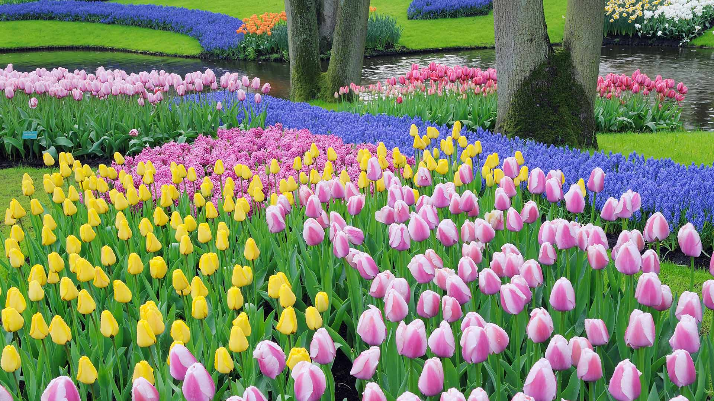

# 郁金香是这里的主角

洒落在叶丛间的光，如碎金般温柔地落在五彩斑斓的花海之上。粉白渐变的郁金香舒展着身姿，似甜梦初醒的少女，在翠绿的茎叶间轻吐芬芳；明黄的郁金香如澄澈的光斑，将暖意铺展成无边的春野。葡萄风信子如幽蓝的星河，与粉色、橙色的花毯交织成绚烂的画卷，树干环绕之间，水面倒映着花的斑斓与天空的浅淡，构建出自然与人文交融的诗意构图。  

这幕色彩盛宴，是库肯霍夫花园的地理与文化密码。荷兰低地特有的温润气候与精心设计的园林，让郁金香这片“国花之域”在春天盛放如狂欢。库肯霍夫之名，源于“饲养场与花园”的呼应，是园艺与自然对话的千年坐标。荷兰人用代代培育，让郁金香成为民族精神与经济的象征，而库肯霍夫则将这份热爱凝成艺术的花园。葡萄风信子与郁金香的搭配，是园艺艺术的巅峰：前者以绵密如绒的蓝托住后者的张扬，却在地理的温床（肥沃土壤与水系）与文化审美（对色彩秩序的珍视）下，生长出生命迸发的乐章。  

当风掠过水面，花浪轻颤，这方土地便成了花的乌托邦。郁金香作为主角，不止是视觉的盛宴，更是荷兰千年与花共舞的文化注脚，是地理赋予的温柔，与人类审美痴迷交织的华丽长诗，诉说着人与自然在旷野与园径间共谱的浪漫史诗。