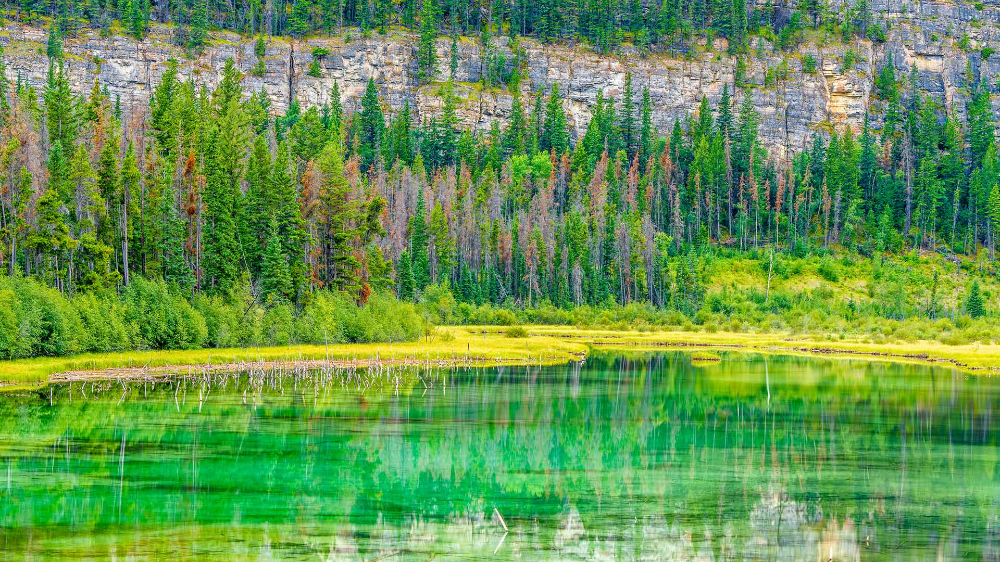

# 贾斯珀的自然魅力

在贾斯珀国家公园的这片天地，自然以诗意的灵韵展露无遗。澄澈的湖水如翡翠得名，将阳光与山林染成从浅绿到深碧的渐变，每道涟漪都似自然写下的散文诗，倒映着森林的葱郁与山崖的苍茫。暖光轻笼，为水面的翠色添上一层温柔的光晕，仿佛是时间在此刻静止，让光影与色彩编织成一幅立体的绘画。森林里的树群错落，深绿针叶林与些许泛着褐红的枝桠相间，像是时光在树梢刻下岁月的纹路，而巨岩纪念碑般的山崖，以粗粝的质感与植被的葱郁形成强烈又相融的对比，构成空间里极具韵律的构图。  

这片湖泊与湿地，不仅是自然造化的视觉盛宴，更是阿尔伯塔地质与生态文化的掌纹印记。贾斯珀国家公园依托古冰蚀地貌，在水与林的交融间，寄存着土著文化与自然历史的千年交融记忆。湖泊的碧波，是生态系统呼吸的载体，承载着从水草到飞鸟的生机脉络；山林的诗意，是自然永恒馈赠，见证着土地与生命的共生与变迁。当目光沉静于这片原生态景致，我们看见的不仅是自然美景，更是对「守护野性之美，敬畏自然永恒」这一精神的唤醒——这里，是野性与诗意共舞的场域，也是人类在与自然相拥时，重寻心灵故乡的境界。