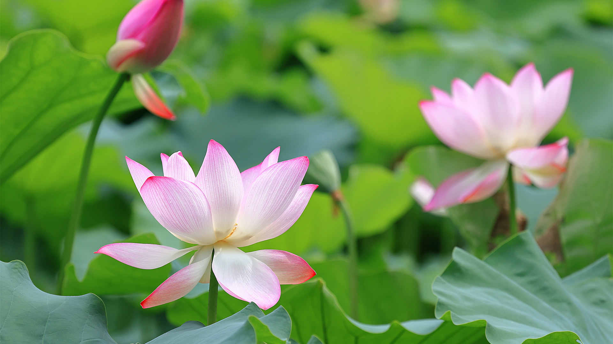

# 藕花风起，首夏清和

光影如丝缎轻覆荷塘，晨间微光将粉荷的肌理勾勒得通透如绢。近处那朵初绽的白粉莲花，花瓣边缘染着柔嫩的朱红，在光影里舒展如烂漫的笑靥，似将首夏的温柔全体绽放。花瓣上的脉络随光流转，泛着柔和的粼粼细光；周围荷叶如团团翠盖，深绿与浅绿交织，叶脉在光影下错落，像是大自然排列的翠色诗行。朵朵花苞若含情的萌动，在绿叶间若隐若现，为画面添了层朦胧的诗意，构图这般层次，将清和的初夏景致铺展得清新又安心。  

荷花之于地理与文化，是江南水泽与人文精神共生的见证。古往今来，荷塘是文人绘景描志的灵台，周敦颐“出淤泥而不染”的哲思，让荷成为高洁的象征；而水乡里，荷塘是生命栖息与农耕文化的纽带，塘鱼游弋、荷叶遮阳，是水系生态与民生浩荡的注脚。首夏时，当暖风初起，荷塘便成一片清和的图景，光影与色彩交织的瞬间，不仅是自然之景的馈赠，更承载着地域对水韵的依存、对清雅意境的追求，每片荷叶、每朵莲都似在诉说古往今来人与自然的和谐，以及在岁月里沉淀的文化温度。