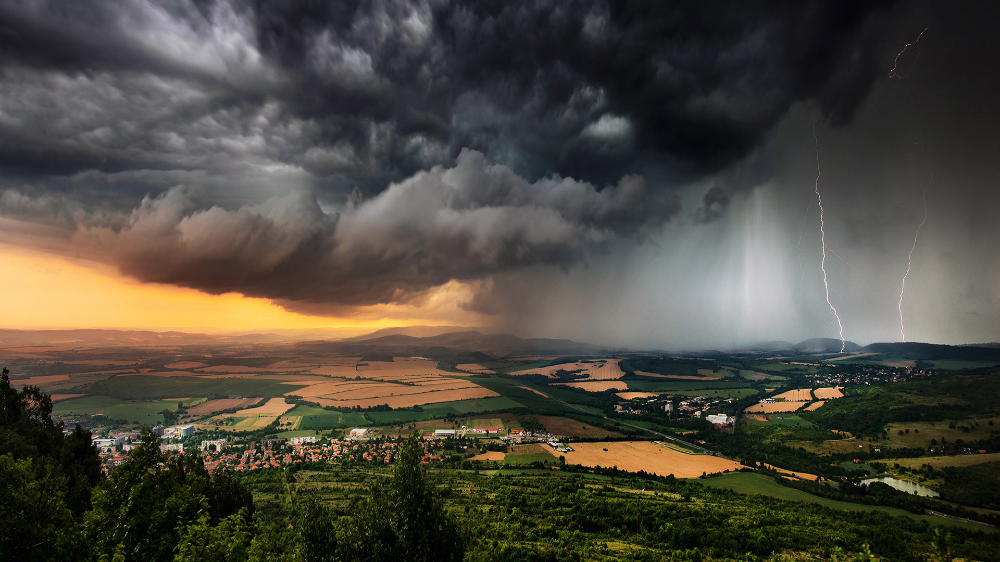

# 承受压力之下的平原

在高空的雷暴正以超越语言的威严，压制着保加利亚广袤的平原。如墨染般的乌云在天地间汹涌奔突，厚重得仿若要突破空气的界限。光影在此化作凌厉的画笔，暗沉的灰与金属般的银相互交织，闪电宛如挣脱束缚的神明之痕，在云层撕开一道道震耳欲聋的裂痕。地平线处那抹慈悲的橙黄，似大地深处的温柔回击，与天际的暴戾形成强烈对比，这一幕是对自然力量狂野诗意的呈现。  

平原本身是岁月的承载者，金黄色与翠绿相间的田野，是自然四季转换的痕迹，几何化的方块见证着农业文明的延续。近处错落的建筑群，则诉说着人类在天地变动中安稳栖息的故事。雷暴永远是土地的戏剧性注脚——在保加利亚的文化脉络里，暴风雨常被赋予宗教或神话般的象征，是大地回响祖先智慧的声音。当闪电劈开云层，仿佛是自然界在考验平原的承载能力，也见证了人类与土地穿越季节、风雨的坚韧共处。这片平原，在风雨交织的一瞬，成为自然与人文共振的绝妙注脚，每一次雷鸣都是对土地记忆的重塑，更是文明世代延续的证明。