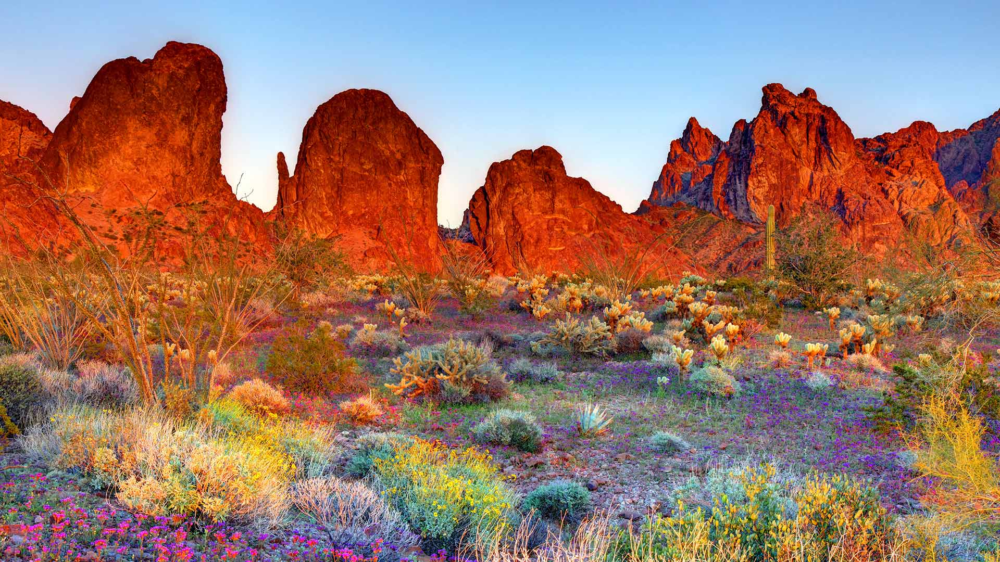

# 广袤铺展的沙漠

当阳光以温婉的姿态倾洒在科法国家野生动物保护区的荒漠时，整个天地便沉浸于梦幻的光晕之中。画面里，赭红色的岩峰如雄伟的巨兽般耸立，在晨昏光线轻抚下，其纹理与棱角被晕染成流动的色彩，暖橘与暗紫交织的色带似时间留下的轨迹，在岩壁上承载着千万年的风霜印记。近景处，沙漠植被以绚烂的织锦填满每一寸空间——紫色野花如同繁星点缀于沙土，仙人掌与丛生灌木交织出绿与黄的层次，阳光亮痕掠过叶片与石砾，让色彩在砂砾与草木间流溢，构成着一曲生命的华丽乐章。  

这份视觉的诗意，背后是荒漠与自然的深情共鸣。科法保护区不仅是亚利桑那州地质奇迹的注脚，亿万年的风蚀与水流塑造了这奇伟岩峰，更承载着生命的坚韧与传奇：那些硬挺的仙人掌、倔强的野花，在干旱与酷暑中顽强生长，成为荒漠精神的生动写照。而这片土地，更是一座数百年来人与自然共生的文化宝库——保护区的建立，不仅是守护一片自然景观，更是在守护浓缩着地理记忆与人文灵魂的圣地。当光影悄然划过岩峰，每一道褶皱与色彩，都在诉说千万年关于荒漠、生命与文明的传说，让我们在广袤的天地间，既惊叹于自然鬼斧神工的壮美，又感动于生命不屈的灵性与文化传承的厚重。