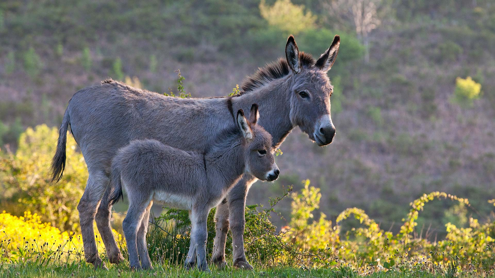

# 撒丁岛的温柔与乡野私语

夕阳将柔和的柔光轻覆在撒丁岛的草甸上，那头深灰色的母驴与幼崽，宛如从时光褶皱中走出的温柔信徒。光影在此处织就了温柔的滤镜，母驴修长的脖颈间，蓬松的鬃毛随呼吸轻颤，灰褐的皮毛在暖光下泛着温润的银灰，如老故事里晕开的温柔光晕；幼崽圆嘟的躯体紧挨着母驴，浅灰的毛色里透着未褪的幼嫩，每道皱褶都盛满基于血缘的安定。色彩在画面里晕染成自然的怀抱：前景中翠绿草叶与鹅黄野花交织错落，后景的植被层则在暖调光线中化作朦胧的绿紫渐变，构成一首关于乡土的诗行。  

构图如一幅被精心裁剪的静物画——母驴的轮廓如守护的温柔盾牌，幼崽的生长则在母身阴影处悄然舒展，空间的留白与植物的自然错落，让这份亲昵既醒目又含蓄，仿佛在诉说土地与生灵间千万年的承诺。而这份静穆背后，是撒丁岛深厚的地理文化密码：驴群曾是人畜共栖的文明牵绳，承载当地人的生活与生产，如今它们的身影仍静卧乡野，成为生态与历史交融的活注脚。当母驴的影子泼洒在草坡，当幼驴的咿呀化作风的声音，它们的存在早已超越动物，成为这片岛屿对自然与文化的温柔回响——每一个存在的瞬间，都是土地与生灵共同书写的古老诗章，也印证着人与动物、与土地长久共生下的岁月温情。