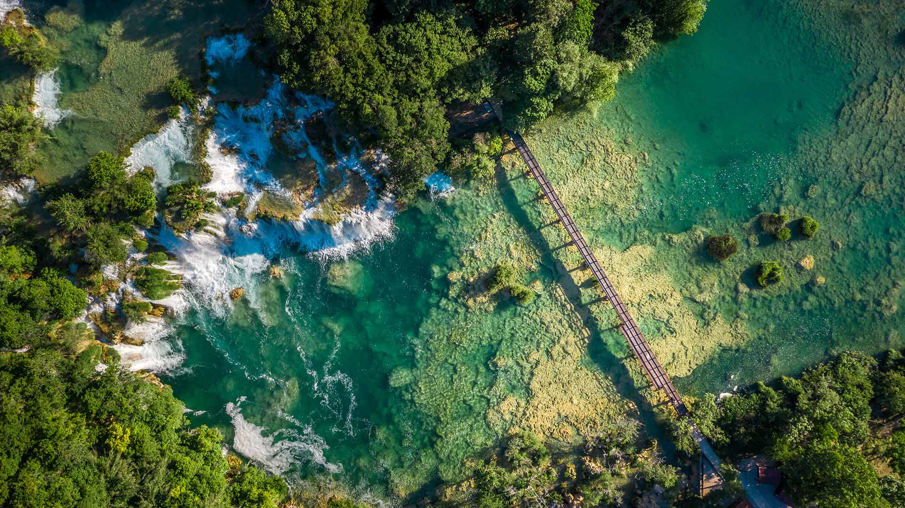

# 克尔卡的造物主  

当航拍镜头定格于克尔卡国家公园的这片景致，斯克拉丁斯基布克瀑布如大地抒写的诗篇。阳光以轻柔的姿态切割空气，在瀑布的白色水花上镀上粼粼金辉，似星子簌簌坠落于清潭。碧绿色的潭水如翡翠般晕染开来，每一道波纹都折射着生命的鲜活；两岸森林铺展为浓墨色织锦，叶片在光影里舒展，将自然脉络刻画得斑驳又密实。木质栈道如灵动的丝带，斜横于水际，在山水交响中融入人文温度，与自然景致相互回应，构成一幅天地和鸣的图景。  

这画面背后，是自然与岁月的对话。千万年水流以沉稳韵律雕琢河床与岩石，让克尔卡的水脉成为地质史诗，记录下这片土地的代代变迁。而这样的瀑布群，在克罗地亚文化里不止是风景——它是自然的圣所，是先民触摸大地的精神锚点，是心灵在山水间寻找归处的归途。当木质步道引着访客穿梭，恍若闯入一方超凡秘境，每一滴水分子都承载着爱与文明的回响。此处，瀑布是大地的造物者，亦是时光的见证者，将自然之美与人文之礼熔于一汪碧水、飞溅的水雾间，让每个凝望者，都能触摸到自然与文化永恒的共鸣。