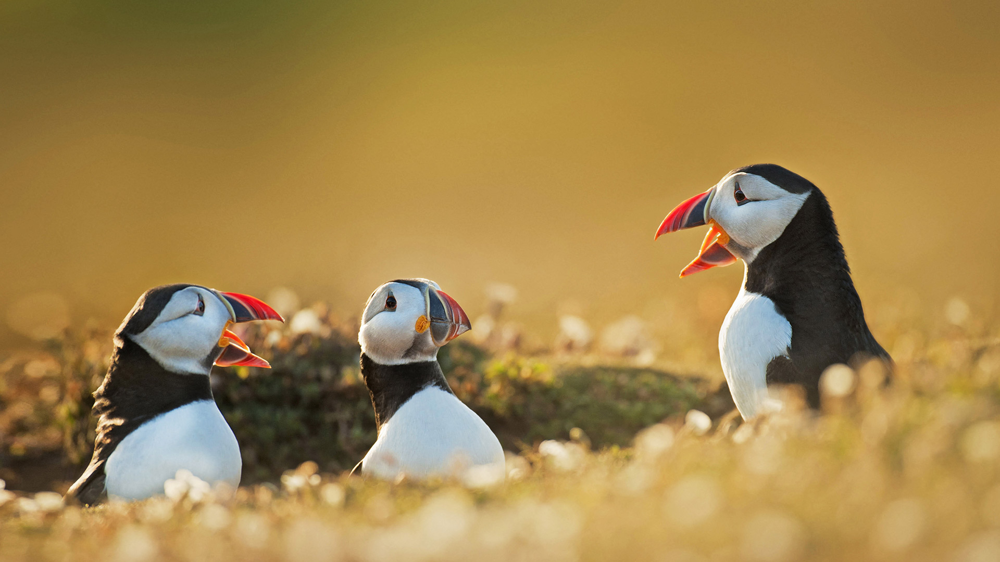

# 振翅, 潜水, 生存  
暖金色的阳光如轻纱般延展，三只北极海鹦静立于风轻拂的草地上。它们黑白交织的羽毛细腻柔和，红橙色喙鲜亮夺目，在柔和光影的笼罩下泛着鲜活光泽。远处背景晕染成温柔渐变，似岁月浸染过的旧梦，为海鹦身姿增添诗意滤镜。构图里，三只海鹦姿态错落有致，有的似振翅前的蓄势，有的如潜水归途的歇息，光影与色彩交织间，尽显生存的艺术张力。  

这画面中的生存之姿，串联起威尔士沿海的地理文化脉络。威尔士的港湾、悬崖与礁石，是海鹦栖息与远游的舞台，它们往返于海洋与陆地，以潜水捕食、振翅远翱维持生态平衡。在当地民俗文化中，海鹦是海洋文明与土地文明的联结者，被视为丰收与海洋生命守护的象征，渔民与自然共生的智慧，也在守护海鹦栖息地中延续。每一道光影落在海鹦身上的瞬间，都在诉说“生存”的诗意——于严酷环境中寻得诗意，于挑战里修炼生命哲学。振翅时，是心跳与风的共振；潜水时，是与海洋的契约；而此际静立的瞬间，是自然教给生存的沉默智慧。它们在威尔士的土地与海洋间，书写着“振翅、潜水、生存”的生命史诗，也让这片土地的文化记忆，与自然生命共生共荣。