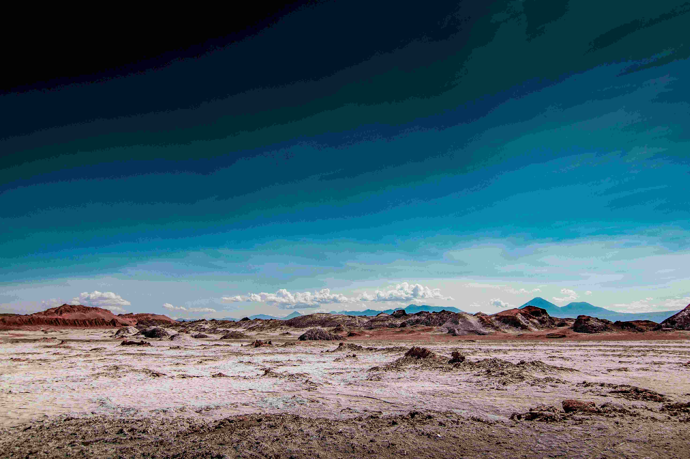

# Atacama: The Celestial Desert

在阿塔卡马的旷野中，天空如被苍穹晕染的画布，从深邃靛青向澄澈湛蓝渐次舒展。光影如轻柔纱幔，轻覆在广袤大地，让荒原肌理在漫反射中泛起温柔光晕。地面斑斓色彩交织成自然乐章——红褐与灰白、矿石与泥土的色调，似地质史诗中跳动的音符，每一寸土地都承载着千万年风蚀与沉积的刻痕，在光影里诉说岁月沉浮。  

画面的构图如宏大诗章，远处山峦与近处地平线层次分明，起伏岩丘如沉默巨匠，在开阔天际下延伸无垠张力。当目光游弋于天地之间，恍惚间竟觉踏入异星疆域，那纯净蓝天、荒凉却绚烂的原野，逐一叩击着对“自然本态”的认知边界。  

阿塔卡马，这片世界旱域奇迹，是地质与文明的共生场域。它以千万年寂静，孕育火山熔岩诡谲形态，也承载古印第安“与荒原共生”的文明记忆。当光影漫过荒原、色彩晕染天地，这方“地球之外”景观，既是自然鬼斧狂想的印证，也是人文与天地对话的永恒注脚。在此，每一步行走都是与时空对话，每一抹色彩都是历史与自然的私语，我们读懂这片“异世界”里，自然造化的奇迹与文明沉淀的深度。