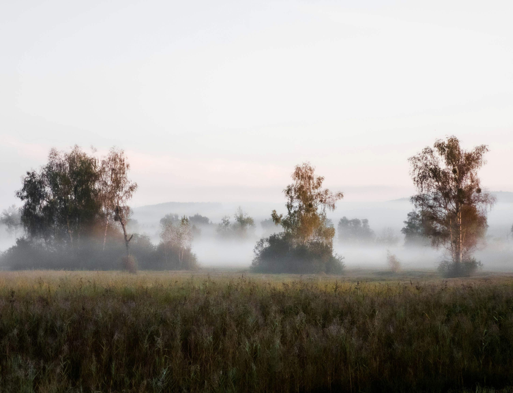

# A雾境里的大地诗行  
晨雾如轻柔纱幔，缓缓笼罩这片田野。光影在晨曦中变得格外温柔，缕缕薄光从雾层缝隙斜斜洒落，给近处的草地覆上淡金的轮廓，也为远方的树木镀上透亮的暖意。色彩在雾的晕染下愈发婉约，近景的草地在深浅绿与黄之间交织，像大地舒展的生机肌理；中景的树木在雾中泛着深褐与枯黄，似岁月沉淀的诗行跃动；天空从浅灰渐变至柔粉，与雾气相融，模糊了天地边界，化出一层空蒙的诗意。构图如一座微缩的天地剧场，前景是蓬松的草地，层次清晰地向远方延伸，中景的雾气如轻纱筛出朦胧的景致，远景的山峦在雾的轻绕下成为淡远的尾声，整个画面由近及远，将天地的呼吸凝练为一气，漾着宁静又深邃的韵律。  

这片雾境背后，藏着地理与文化的深层故事。此地应是山水环抱的湿地或河谷地带，晨间的水汽因地形低洼与昼夜温差凝结成雾，是自然生态的精妙馈赠。远处的树木或许是当地的乡土品种，见证了岁月中人与土地的相依相恋：古时此地的人们依水而居，在雾中劳作、驱赶家畜时，这些树木曾是指引方向的温柔守护者；如今，这片雾境也成了文化的隐喻，激发着画家笔下的意境、诗人的抒情哲思，成为自然与人文交融的注脚。雾的朦胧承载着时光的温柔，每一缕雾气都是大地呼吸的回响，每一棵树都沉淀着岁月与文化的温度，让这片雾境既有着自然景观的空灵诗意，也藏着人类历史与文明的深意。