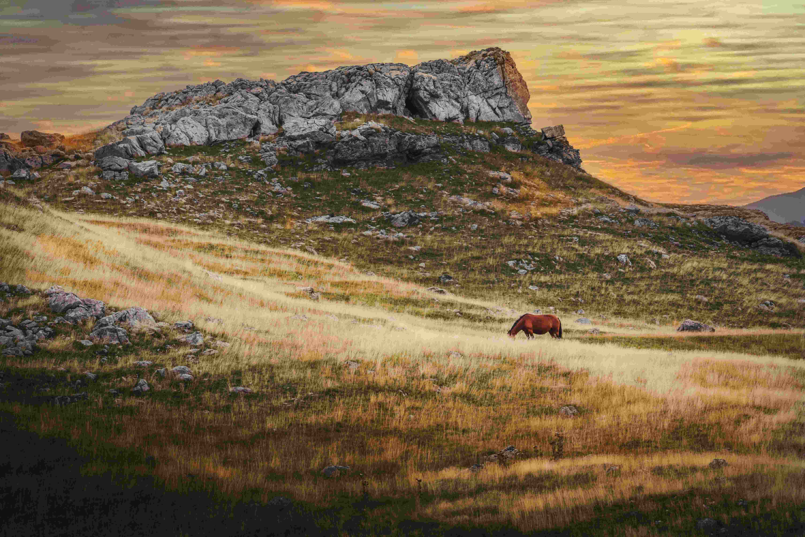

# Nature and Animals

在暖金色的天幕下，崎岖的山岩静静耸立，岩石表面的纹理被柔和的光线剥蚀得清晰可见，灰白色的肌理与山风一同诉说岁月的沧桑。山野间，金黄与墨绿的草甸如波浪般起伏，每一道光影都在纤维般的草叶上舞动，将阳光的温度织进自然的肌理。红棕的马低头亲近青草，身影被暖光晕成温柔的轮廓，与周围的山野融为一体，成为这天地共栖诗画中灵动的注脚。

这幕天地之景，藏着地理与文化的深厚脉络。这样的山野草甸，多是人类与自然共生的游牧领地，马是土地与生灵间情感的纽带——它们穿梭于旷野，土地以草甸给予滋养，岩石以沉默见证时光。当夕阳为山川镀上金边，马与山野的依偎，不仅是自然美景的生动定格，更承载着区域文化中人与动物、与自然相互依存的古老共鸣，是山水间流淌的生命史诗，每一寸光影都晕染着岁月与自然的深情。