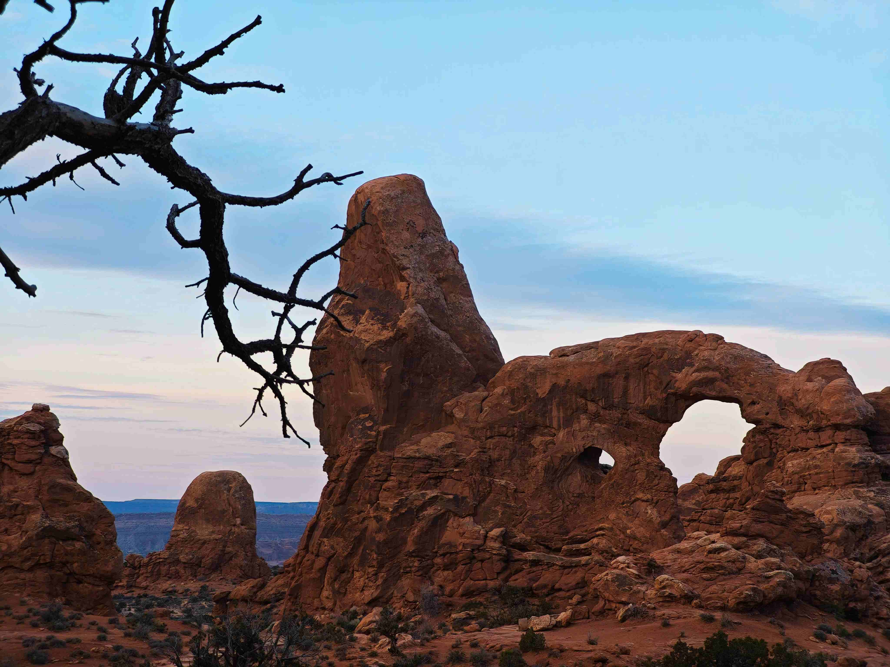

# A rock formation with a tree in the foreground

当视线落在这片天地间交融的暮色与朝霭之境时，前景的那株枯树如块墨色诗行，在暖棕色的岩层上舒展出孤绝的枝桠。岩石的肌理在柔和光影下泛着时光的褶皱，赤褐色调似大地沉睡后的脉搏，在渐淡的天空中晕开层次分明的温柔。天空是清透的淡蓝，与岩石的锈红形成坚韧而温柔的对比，高悬的云絮如朦胧的诗句，为这硬朗的地形镀上轻柔的滤镜。  

岩石的轮廓是自然鬼斧神工的注脚，那拱形结构与挺拔巨石，纹理中的凹陷与凸起，都承载着千万年地质变迁的痕迹。砂岩经风化、侵蚀后，形成了如今的造型，每处起伏都是岁月印记。前景枯树的存在，则成为生命坚韧的注脚——在严苛的自然条件下，它以孤寂的枝桠见证岩石千年的沉默，也呼应着这片土地与自然共生的生态记忆。  

这画面背后，是地质与文化交织的史诗。岩石与树木共同诉说着这片区域长期的生态变迁与人文脉络，它们是自然与生命对话的见证者。每一道光影的褶皱、每一处色彩的变化，都成为时光馈赠的故事载体。当风掠过岩石与枝桠，仿佛能听见千万年前的风声与今朝的静穆共鸣，让人们在仰望中感悟自然的力量与岁月的温柔，也悄然理解这片土地自远古至当下的精神密码。