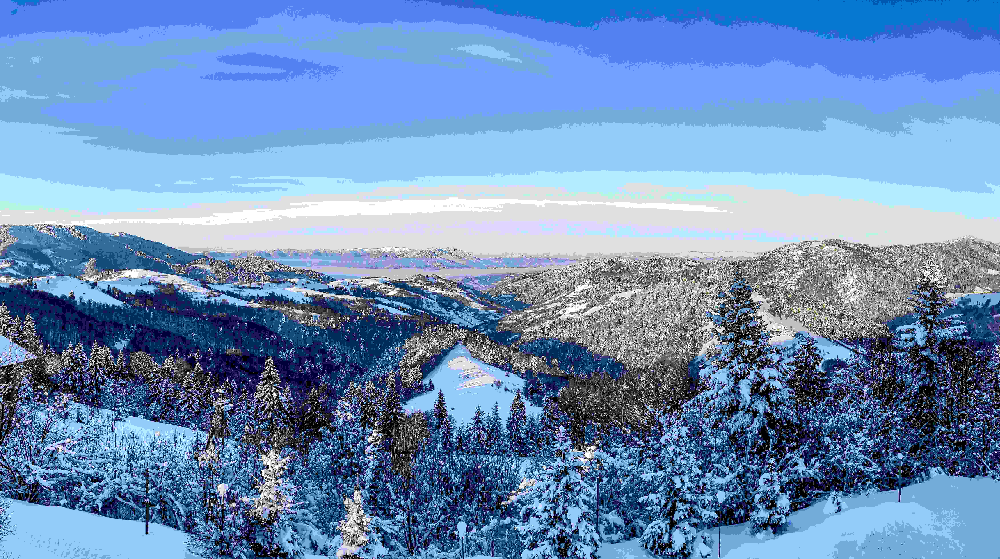

# Snow-Covered Peaks and Forests in Daylight

在白日的光照之下，这片被白雪笼罩的山野展开了一幅纯净至极的图景。阳光轻柔地洒落在覆雪的峰峦与针叶森林之上，将整个天地浸在澄澈的光影里。**光影**在此处演绎得妙趣横生——晶亮的雪面折射着天光，仿若散落的星芒闪烁跃动，而阴影则在深色林木与起伏的雪山间悄然晕染，明暗交织间，勾勒出自然的刚健与温柔。**色彩**的层次朦胧又明快，纯净的雪白如圣洁的绸缎铺展，森林的深黛与苍灰是大地独有的质感，头顶的蓝天或为湛蓝，或被薄云轻笼成淡紫灰，与白雪之间晕染着柔和的过渡色，让视觉在冷静与温婉间找到平衡。**构图**上是天地间的大尺度景致，层层叠叠的雪山怀中环抱密林，深谷与高峰的走势如自然谱就的史诗，将永恒与瞬息融于同一画面，让观者沉醉于自然浑成的壮美。  

这般雪覆山河的景致，背后是地理与文化的深邃交融。这处山地或坐落于一寒冷的高原或山脉区域，寒冷气候塑造了针叶林与雪山共存的独特生态，而这样的自然景观早已成为当地文化的精神底色——从古时原住民对雪山神灵的敬畏崇拜，到现代人对冰雪旅游的热爱探索，雪景始终是连接人与自然的精神纽带。每一次雪的堆积与消融，都是岁月与地理力量对话的乐章，雪的纯净与厚重，记录着季节更迭，也承载着这片土地的文化记忆与生命传奇。当阳光穿透银白的世界，这片雪景不止是自然之美的呈现，更是地理与文化在时光中酿就的永恒史诗。