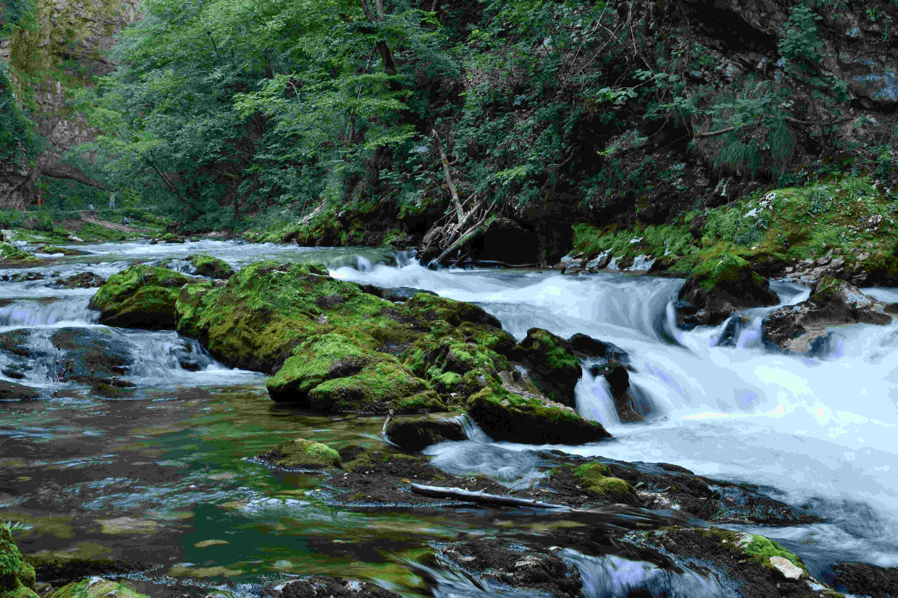

# A Small Stream Running Through a Lush Green Forest

柔光穿透茂密的森林，在溪面上刻下细细的光影，如丝缕温柔的纱。溪水的浪尖泛着冰晶般的白，在青褐色交织的岩石间轻舞，岩石上的苔藓如翡翠飘落，在光影里晕染层层绿意，深浅相叠，像岁月在石头上绘就的鲜活水墨。  

色彩在此处迸发蓬勃张力：森林的墨绿与溪水的青碧交融，似大地舒展的肺叶与血脉晕开，岩石的暗褐嵌入其间，却为绚烂添了沉静。溪流的白浪如灵动丝带，穿梭于翠绿苔岩之间，阳光泼洒水面，水色随波流转，从浅绿到深碧，像秘境内流转的晶石，每一道波纹都缀着光与色的碎金。  

构图如天然艺术构架，小溪似丝带穿引画幅，上游缓流、中游奔涌、下游柔缓，层次分明又和谐共生。森林在溪流身后托出厚重深邃的背景，枝叶疏密勾勒出空间呼吸感，岩石错落是自然的肌理，近景苔岩湿润生动，远景林涛如绿浪，将视觉引向幽远林间，让人与这方自然彻底沉浸于时光的静谧与生机之中。  

凝望间，触碰到这片天地的时光脉络：溪流冲刷的岩石是岁月刻痕，繁茂森林是自然怀抱。祖先依溪而居，视水流为生命脉络，林间开辟生存之路，溪水浸润的土壤孕育了独特生态，也滋养着人文记忆。每一处苔藓纹路、每一道溪水褶皱，都藏着时光里人与自然相融的诗意故事。这片溪谷是生态与文化的共生场域，让自然之美与人文情怀静淌，如溪水般持续滋养心灵。