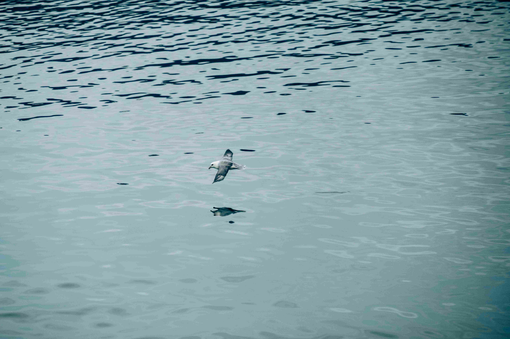

# a bird flying over a body of water 

澄澈的水面如被岁月浸透的蓝绿色调，光影如细碎的星子，悄然铺洒在粼粼波纹之上。一只羽毛轻捷的鸟儿振翅而飞，银灰与棉白的羽翼在风里舒展，倒影随水波轻轻震颤，宛如一场无声的灵动感舞。画面中，鸟儿居于视觉重心，水面如镜，将天空与禽影共同编织成一曲宁静的写真。  

这方水域，或许是冰川雕琢而成的港湾，或是沿海湿地温柔的臂弯。鸟儿的翅膀掠过之处，映照着地球地理脉络的远古痕迹——冰川遏制的深海，巧妙联结海洋与内陆的生机。在漫长岁月里，水面成了生命与文明的滋养之域，人类在此捕渔、聚居时，也悄然学得与飞鸟共生共息。水的呼吸与鸟的飞翔，在地理纹理与文化记忆中，织就一道绵延的叙事弧线，承载着对自由与生命的敬畏，也讲述着人类与自然共息共荣的古老歌谣。  

水面的波光流动、鸟翼轻扬，让时空在此轻缓定格，既是个体生命于天地间的自在舒展，也是广袤地理与深厚文化共振的微缩诗章。每一道水纹、每一缕羽梢的振翅，都在诉说自然法则与人类精神的永恒共鸣。