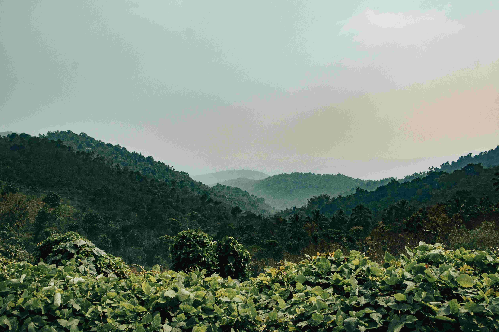

# 茂密森林中的山野诗行

当柔和的光线漫过轻雾，满目都是蓬勃的生命在呼吸。画面里，茂密森林以蓬勃的姿态铺展在层层叠叠的山峦间，每一片树叶都浸润着不同调的绿色——近处是鲜亮得近乎翡翠的繁茂枝叶，叶片间漏下的光斑如星子般碎落，为挺拔的林木镀上温柔的光翼；远处山峦在朦胧空气里，墨绿与青灰层层晕染，构成诗意又辽阔的层次。光影在这里如灵动的丝线，穿梭于树冠的缝隙，为密林勾勒出明暗交织的肌理，让每一道山峦与枝蔓都漾着生命的热忱，疏密相间间，构图中也漾着悠远与苍茫。  

这般森林，是大自然的璀璨诗行，亦是地理文化的共生传奇。在地理维度上，它是生物多样性的宝库，涵养着区域生态的脉络；于文化而言，森林或许承载着代代相传的图腾信仰，或是先民生活生产的活态载体——树叶为蔽身之具、果实作果腹之物，森林深处或许藏着远古的故事与智慧，成为人与自然共生的精神图腾。当风过林梢，树叶的沙沙私语与远山的回响交融，仿佛也在诉说天地灵气在此沉淀的岁月，让这片绿意不止是视觉上的震撼，更成为自然与人文经年对话的载体，在光影与色彩编织的韵律里，镌刻下地理与人文永恒的羁绊。