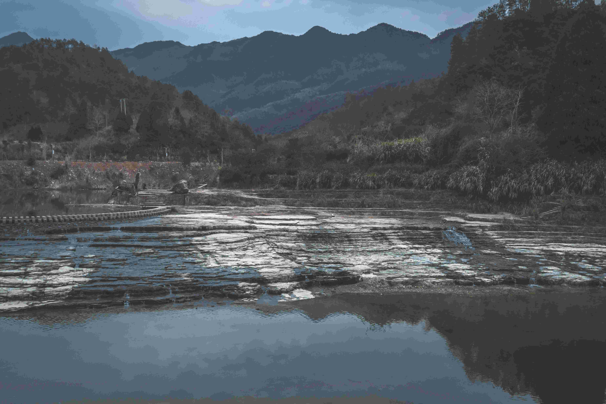

# Green Trees Near River: A Daytime Serenade  

阳光在葱郁的树冠间跳跃，为河畔景致晕染出温柔的光影。当日光倾洒于蜿蜒的河道时，清新的气流里浸润着树木的澄澈秀色与远山苍郁沉静。河水的层叠如岁月编织的纹理，光影在波面漾开银白的波纹，与岸边树影的翠绿交织成一曲自然的交响乐章。  

画面的色彩是自然的诗笺，翠绿树木的鲜活生机与深远处山脉的靛蓝交融，河水的澄澈宛如天空与大地的倒影之镜；构图如弦上的乐章，近岸树影摇曳生姿，中段河水的肌理缓缓铺展，远山轮廓如墨色写意，层次间流淌着时光的呼吸。这片山林与水岸的相依，是自然馈赠的诗意栖居，而当地人与这片绿意的共生，藏着千年关于山水共生的智慧——树木护持河道、河水滋养山林，成为文化与生态共生共荣的脉络。  

在这午后光晕里，每一道光影都倾诉着天地共生的韵律，每一抹色彩都承载着岁月沉淀的温柔。当河畔绿树与山川相映成辉，当光与影在水面轻舞，我们惊叹于自然的鬼斧神工，也感知到地理与人文交织的古老故事：山水相依，文明寄情——这片绿意与溪水共舞的土地，诉说着人与自然对话千年、共生万年的永恒乐章。