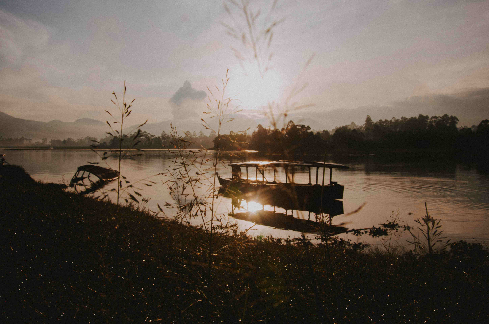

# silhouette of boat on water during golden hour

当金色的暮光轻吻水面，一艘船的轮廓便成了自然与人文交织的温柔注脚。画面里，金色的阳光如流淌的绸缎，将船的轮廓勾勒成深邃剪影，宛如从时光褶皱中浮出的旧梦。阳光穿透青草，在水面洒下幻彩光斑，细碎波纹如温柔脉络，共同勾勒出黄昏独有的韵律。  

水面的色彩是渐变的诗行——近地平线处晕染着暖橘，往天际延伸成了浅灰与粉紫交织的柔和边界，每一道光影都在吟唱“金色时刻”独有的温柔旋律。船的轮廓简约却带着岁月褶皱，或许是当地传承数百年的船型，在水域间穿梭时，既承载着生计的重量，也承载着时光沉淀的温度。  

远处山脉与林木的剪影静静伫立，在水边草本植物似在轻诉这片水域的历史：从前民逐水而居的感动，到船作为连接天地与人心的纽带角色。当光影与水色共舞，这不止是自然景观的交织，更是地理与文化的共鸣——水域孕育了独特的生活方式，船成了文化记忆的载体，金色的暮光则为这一幕镀上永恒诗意滤镜，让时光在此刻停驻，也让远方的故事，随船影故事在风与水上轻轻漾开，每一道光影都藏着文化与地理共生的故事。