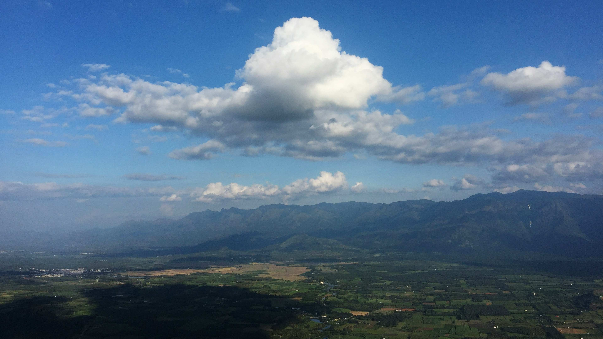

# A View of a Mountain Range from a Plane

从高空凝望，山脉如岁月镌刻的雄奇画卷，在澄澈蓝天下舒展。明澈的蓝调天空里，蓬松的云朵如棉絮般轻漾，那朵硕大的积云似绵软棉花糖，边缘晕染着柔和雾霭，与连绵山峦交织成梦幻织锦。阳光以温暖的光弧洒落，给深色山体镀上温润金边，山影在光影中如沉静古卷，而近处田园的翠绿如鲜活墨韵，田梗与远山灰调相叠，构成空间里层次丰富的诗境。天空的湛蓝、云朵的素白、山体的深墨、田园的青绿，在光影明暗间层层铺展，织就视觉上的韵律之诗。

这片山脉下的土地，是地理与文化的共生史诗。远山是历史长河中人类祈梦的屏障，田园是农耕文明的心灵粮仓。山与谷的默契交融，藏着先辈对自然的敬畏与依偎——千年间，山脉作守护之盾，田园作生活图景，云雾是自然呼吸的温柔私语。当云朵往来于山巅与天际，时光似也在此放缓脚步，让人感知到山川褶皱里，先祖对土地的眷恋与文明绵延的福气，每一道山川脉络，都承载着地理生态与人文精神的深度融合，成为岁月沉淀的文化符号。山脉的隽永、田园的鲜活、云霭的飘逸，共同谱就了一曲人与自然相伴相生的地理文化乐章。