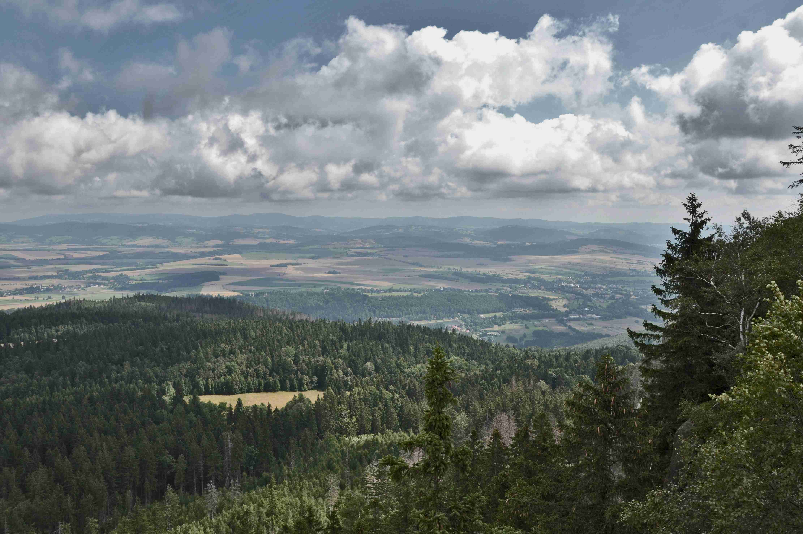

# Green Trees Under White Clouds During Daytime  

白日时分，当目光掠过那片森林时，仿佛时间都慢了下来。天空如淡墨晕染的布帛，栖息着蓬松如棉絮的白云，它们或舒展、或聚拢，在蓝灰色的天幕上织就自然的笺纸。林间树海如绿浪翻涌，深绿与葱郁交织，不同品种的树木在阳光下闪耀着特有的光泽——针叶的苍劲、阔叶的鲜活，于光影中舒展才华。  

阳光透过云层的缝隙，在树梢上洒下斑驳的光影，老树枝桠间漏下的光斑，在草甸与林底形成温柔的几何，给林间增添了灵动的呼吸感。远方的田园在云影下收放自如，斑斓的黄绿与褐灰相接，如岁月晕染的油画，把山林的苍翠与平原的 jovialism 熔为一炉。  

这般景致背后的地理文化，悄然诉说着土地的故事。这片森林或许是当地历尽沧桑后的绿肺，长久以来哺育着周边村落，当地人世代崇敬森林为生命母体，如今森林也成了人们亲近自然、寻获内心的圣地。云朵下树海的憩静，承载着时光沉淀的人文记忆——先民在此伐木、狩猎，后来人们在此建路、休憩，森林与山水共同构成了一部活的地理与人文史诗，让自然之美与人文脉络在此处找到平衡与交融。