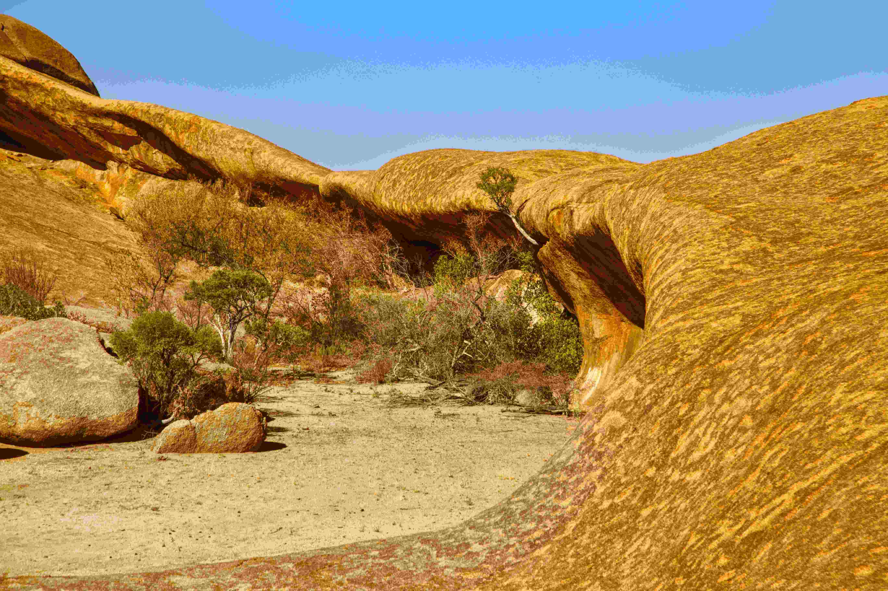

# Erongo mountains

在阳光如绸带般铺洒的时刻，Erongo山脉的岩石景观如大地演绎的史诗。金色与棕褐交织的巨岩，似岁月在风沙与泥土中浇筑的符号，每道纹理都藏着千万年的风霜记忆。光影如温柔的笔触，于岩石表面勾勒出流畅的弧形轮廓，暖色调的肌理在干旱的土地上一层层漾开，与澄澈湛蓝的天空形成和谐又强烈的视觉对话。近景的岩石如巨兽高昂的颈项，粗犷的弧度与深邃的凹陷间，藏着一篇地质变迁的密码；地面的沙土点缀着稀疏却坚韧的植被，为这硬朗的岩层景观注入了生命的呼吸感，让荒漠也成了生命休憩的温柔场域。  

这片地貌是自然千万年侵蚀与风化的杰作，岩石的形态诉说着土地生命的坚韧与创造力。在地理文化层面，Erongo山脉或许是当地原住文明的精神图腾——岩石被祖先视为神圣载体，承载着古老传说与生存智慧，成为自然与人文记忆交织的脉络。当目光穿越岩石间的缝隙，仿佛能触摸到这片土地承载的历史重量，地质变迁与人文传承在此相融，让Erongo山脉不仅是个体地貌奇观，更是一曲关于永恒、坚韧与传承的地理文化史诗。