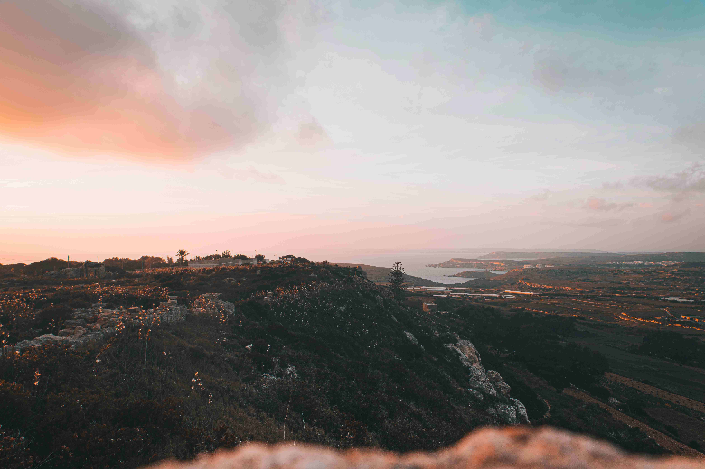

# Sunset shot of the great landscape in the South of Malta  

当夕阳为马耳他南部大地晕染时，天地间的一抹温柔正悄然铺展。画面中，天空如渐变的水彩，从暖橘色的地平线静静过渡到青灰色的苍穹，云层似轻柔的绢帛，将夕阳的余晖揉碎成粉金色的碎影。山峦在光影里呈现苍劲轮廓，岩石与植被的纹理被暮光镀上一层琥珀色的柔光，宛如上古神祇留下的生长印记。  

构图如一首静穆的诗：近处是斑驳的石墙与丛生的野花，它们在夕阳下泛着哑光，诉说着岁月遗留的故事；远处，海岸线如银带般蜿蜒，海湾与平原在暮色中形成层次分明的肌理。天空与大地在此刻达成奇妙的平衡，低垂的太阳成了视觉与情感的锚点，将时光刻进山海的褶皱。  

这大风景背后，是马耳他南部地理与文明的史诗。这片土地曾见证千年的文明更迭——从腓尼基商人在此停泊算起，罗马、基督教、骑士团的历史都刻入岩石与土地的呼吸里。夕阳下的废墟与平原，其实是历史与自然的对话场。当暮光漫过旧巷与废墟，山海承载的不仅是地理的辽阔，更是文明相传的魂魄。每一道光影都在诉说：这片岛屿的岁月，是火焰与霓虹、废墟与新生交织的诗行。而此刻的黄昏，让大地与星空达成一场温柔的和解，将历史的厚重与自然的灵动，熔成画面里那抹渐变的霞光。