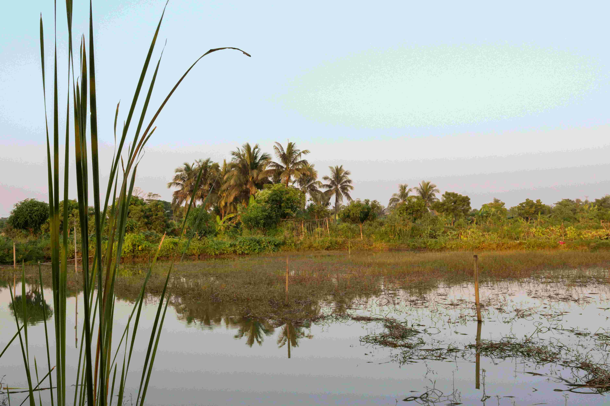

# A Body of Water Surrounded by Palm Trees  
柔和的光线如轻柔的丝纱，笼于水面之上。水面的色泽是温润的灰碧，像被岁月精心打磨的镜面，静静映照着天空的淡青与棕榈树的苍翠轮廓。光影在水面上游走，将天空的色阶与棕榈的葱郁晕染成温柔的层次，每一道光纹都在水波里漾开朦胧的诗意。近景中，纤细的草茎垂落在水边，叶片在微风中轻漾，投下细碎的影子，如自然描摹的墨痕，为构图添了层次；中景处，水面如镜，完美复刻着棕榈树与岸边蓬勃绿植的形态，它们在水光涟漪中舒展枝叶，似与水面私语，将热带风情与生态温柔编织成一帧静谧长卷；远景里，棕榈树成林矗立，枝叶在天色渐晕中勾勒灵动感，为水域晕开奔放又静谧的底色。  

色彩如大自然的交响乐，绿意、灰碧、淡青交织，每一抹色调都饱含着生命的呼吸。水面的平静是时间的褶皱，收纳着天地间温柔的双重映照；棕榈树的舒展姿态，是热带气候馈赠的诗意注脚，扇形的叶姿与挺拔树干，为这片水域框定了一方充满生机的空间。  

这片被棕榈环绕的水体，生长于热带或亚热带湿地生态地带。水为根基，棕榈成冠，二者共同构建独特的地理与文化脉络。水域滋养棕榈生长，棕榈的根系与枝叶又为水体提供生态庇护，成为当地生态系统核心纽带。在当地文化里，这片水域是社区生活的源头——渔业支撑生计，湿地景观滋养心灵，人与自然共生关系深远。当阳光轻吻水面时，水面、棕榈与天色共同编织诗意，诉说人与自然和谐共舞的古老叙事。每一道光影都是地理与文化的注解，见证土地以水域为脉、以棕榈为魂，书写人与自然相伴的温柔传奇。