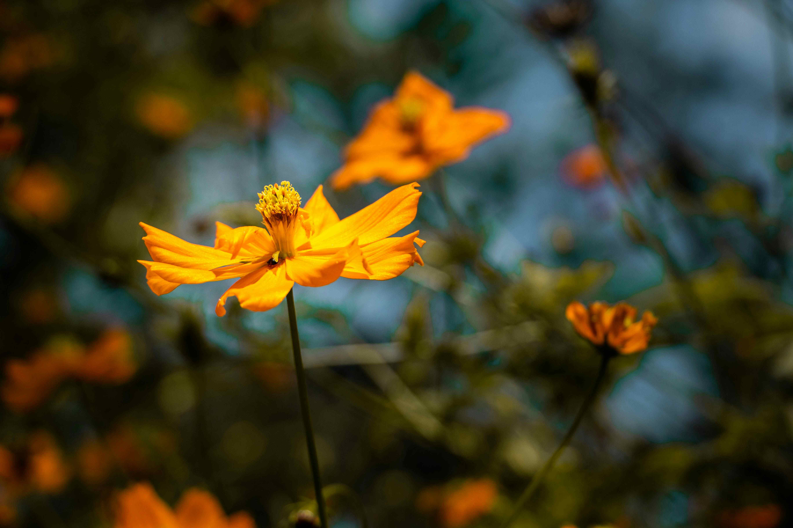

# A Pale of Golden Bloom

日光如碎金般轻洒，那朵金黄的花在画面中央舒展身姿，花瓣似被暖光温柔晕染，每一道褶皱都承载着对光线的至诚。它与背景中若隐若现的橙黄花影相互呼应，构成一幅朦胧的诗意画卷——近景的黄花如不羁的朝圣者，明艳得暖人心房，花心处细碎的花蕊，像是天地间散落的星子，而背光处那些朦胧的花影，又如静默的织锦，在深绿与雾色的怀抱里轻轻摇曳。  

这一抹明黄，是大地写给春夏之季的信。它生长于某个未经修剪的原野或庭院角落，以活力的色彩承载着生机的礼赞。在地理与文化的故事里，这类花朵从古至今都是生命跃动的注脚：古时文人将黄花比作高洁的象征，今朝自然以它明艳的姿态诉说风土情怀，黄花始终是土地与季节的见证者。  

光影在此凝固成画，花朵在时间的褶皱里绽放柔软的力量，每一道阴晴的光变化，都藏着这片土地的风土与温度。当目光追着黄花的脉络，恍惚间触摸到自然与人文的精髓：南国原野的放浪不羁，北方庭院的婉约轻盈，它们都浸润在这金黄的温柔里，成为文化与自然的同频之音。而这一瞬的光影，是花朵对时代的轻吟，也是大地对时光的怀想，让每一缕风都沾着花开的韵律，每一寸光都藏着生命的呼吸。