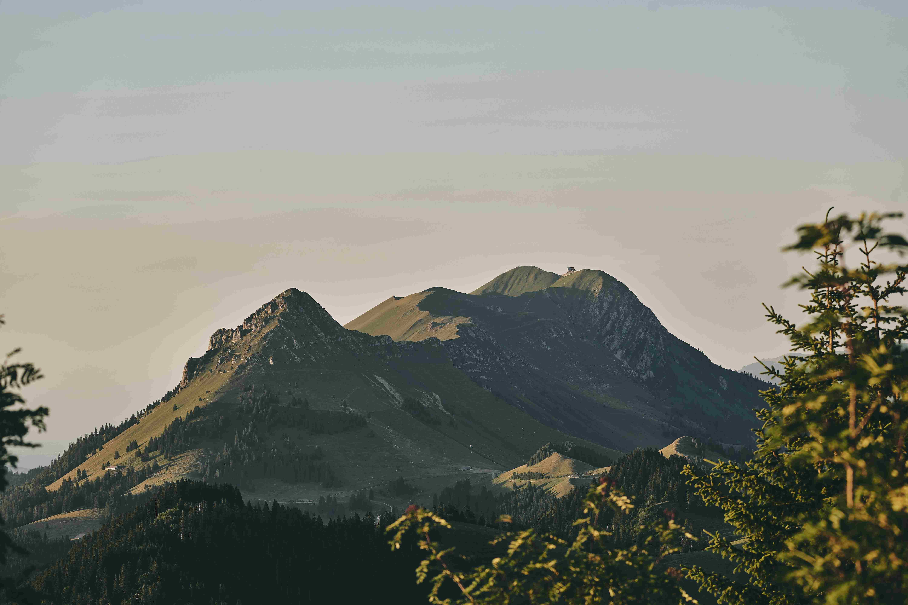

# Green-Leaved Trees at the Mount's Base During Daylight  

在日光轻染的山野间，青山与繁茂的绿树构成了一幅充满生机的自然画卷。柔和的光线如轻纱般笼罩住连绵山体，山岩的深灰与山坡的黛绿交织，山顶处泛着暖金，光影在山脉表面流转，勾勒出层次分明的色彩光谱，宛如大地此刻灵魂的呼吸。山底的新生绿树，蓬勃向上，叶片在微风中漾出灵动，为画面添上了清新与蓬勃的气息。  

这山与树的景致，是自然与地理的深情叙事。山体的轮廓与形态，承载着千万年地质变迁的印记，风、雨、雪与时光共同塑造了这巍峨轮廓。而山底茂密的绿树，是土地孕育的生态窗口，它们见证岁月更迭，也诉说着人类与这片山水共生的文明脉络——古往今来，先民们依山而居，将敬畏与劳作注入大地，如今绿意盎然的山林，依旧维系着人与自然的和谐共生。  

当日光漫过山峦，为天地铺展温柔底色，自然与文化的韵律在此交融。光影的明暗、山体的沉静、绿树的蓬勃，每一处细节都是时光与地理共同镌刻的篇章。这片山野在日光里，既有着地质变迁的历史回响，也有生命生长的蓬勃活力，让山与水、树与石，共同编织出属于这方土地的诗意赞歌。