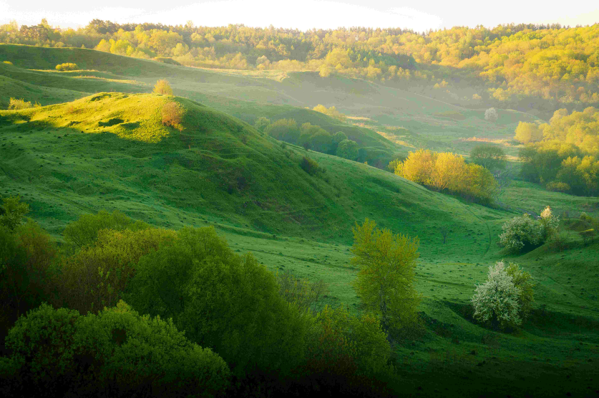

# green grass field under white clouds during daytime  

阳光如轻柔的纱幕笼罩着这片起伏的绿野，每一道坡岗都在光影的晕染下漾开温柔的光影曲线。草地的绿意浓郁鲜活，深绿与浅翠交织，如大地铺展的一幅自然织锦，林边树木漾着暖金色，与草场的翠色相映成温柔的光韵。白天的光线明亮柔和，云朵静卧在高远天际，似蓬松的棉絮，与下方的草地共同编织出澄澈的白昼图景。  

这样的景致，不止是视觉的盛宴，更承载着悠远的地理文化故事。这片草场见证了自然与生命的共生，也承载着当地人与土地千年相守的脉络。当牧歌在坡岗间悠然回旋，当牛羊在绿野中从容漫步，草地的每一次起伏与舒展，都是地域生态的注脚。此地或许是 Carpathians 余脉附近的一处草甸，独特的土壤与气候孕育出这片翠野，人们以土地为伴，以四季为尺，在草场的温柔滋养中生长出质朴的文化与信仰。白日的晴空与青草共舞，不仅是自然奇观的呈现，更是地域文化与生态的交融——一种对自然敬畏与感恩的心意，在时光长河中沉淀为厚重的生命智慧。