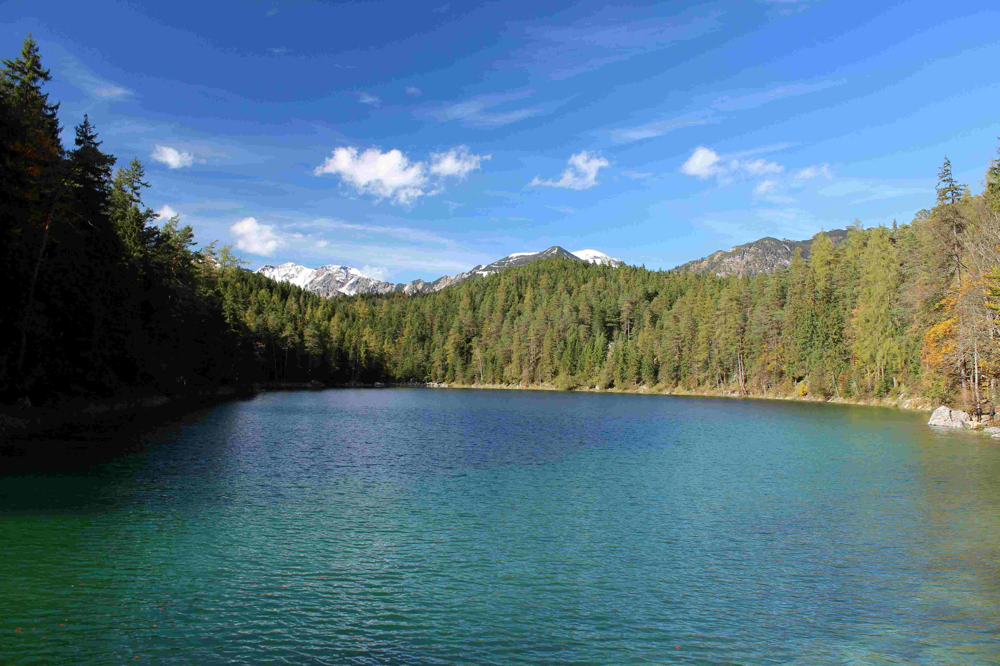

# Green Trees by the tranquil Waters

在昼光裁剪下，一幅充满生机的自然画卷缓缓舒展。近岸的绿树如深浅交织的翠色绸缎，树影轻临湖面，将静谧与灵动晕染在澄澈之水；湖水如宝石般泛着透亮的蓝绿色，映着天空的湛蓝与林梢的葱郁，从近岸的深青渐变为远处的浅碧，似将天空的色彩与林木的绿意悄然融进波纹。阳光穿过枝叶，在湖面洒下碎金般的光斑，波光与树影交织，构成一首流动的光影乐章。画面构图里，湖泊居中为眼，林树环抱为框，远景的雪山与林野共同勾勒出层次——近景树木的浓墨重彩，中景水面的精神澄澈，远景雪山的圣洁清冷，层层递进如岁月雕琢的诗意长卷。

思绪随景致流转，掩映在绿水与翠林后的地理文化故事愈发动人。这片水域或许源于冰川的雕琢，远山雪线隐约诉说着地质变迁与自然造化的痕迹；而周遭林木则是生态循环与人文延续的见证。自古以来，湖泊与林野不仅是自然的馈赠，更是文化与生活的枢纽——从先民依水而居、依林而渔的生存智慧，到今时生态保护下山水共生的文明形态，自然景观永远承载着地理与文化的脉络。这方天地不止是一幅视觉的盛宴，更是山水共生的文明注脚，记录着人与自然和谐共处的千年故事，让自然之美的韵律与人文精神的厚度在此处悄然共鸣，成为一座可触摸历史与诗意的精神高地。