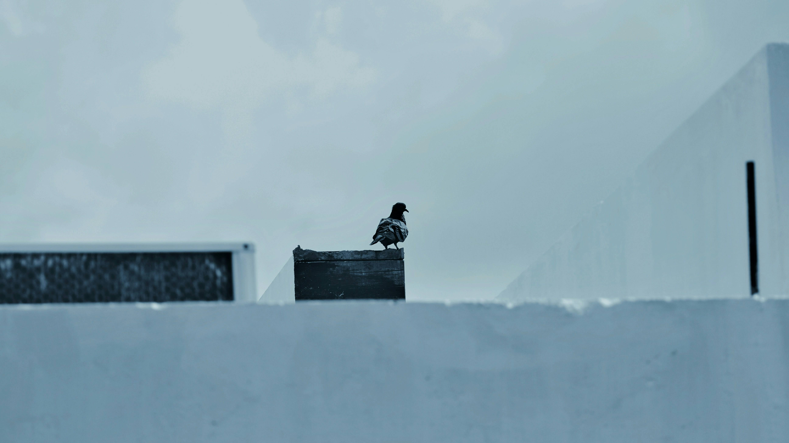

# 雪地黑盒上的静思  

晨光轻覆于覆雪的地面，那片银白如缎的雪野，似承载着天地间的静谧气息。画面中，一只羽毛交织着黑白纹理的飞鸟，稳坐于深色的木盒之上。日间柔和的光线在雪野上缓缓流淌，给这片区域晕染上淡淡的雾霭，天空呈浅蓝灰色调，与雪地的纯净形成柔和的冷暖交织。光影如轻柔纱幕，为黑盒与飞鸟的组合添上一丝静谧感，构图上飞鸟与黑盒成为视觉锚点，在广袤雪景的衬托下，既渺小又醒目，宛如天地间一处静默的风景注脚。  

这冬日雪境，是地理与文化的深沉交融。冰雪覆盖的土地，见证着寒冷地带人们与自然的和谐共生。那块黑盒或许是人类活动留存的痕迹，与自然冰雪的纯净肌理共同存在，而飞鸟在此栖息，是自然赋予生命的专属场域。雪的洁白、盒的深色、鸟的静立，共同编织出一幅冰雪地域文化的图景——这是寒冷环境中人与万物达成的静默契约，是冰雪文化里生命存续的诗意注解。当光线在雪野上舒展，当生物于黑盒上静思，我们看见的，是自然与人文在极寒之地，酿就的一曲悠久且温婉的地域叙事。每一寸雪的光影、每处构图的张力、自然与人文的交融，都在诉说着这片土地独特的生命韵律与文化根脉。