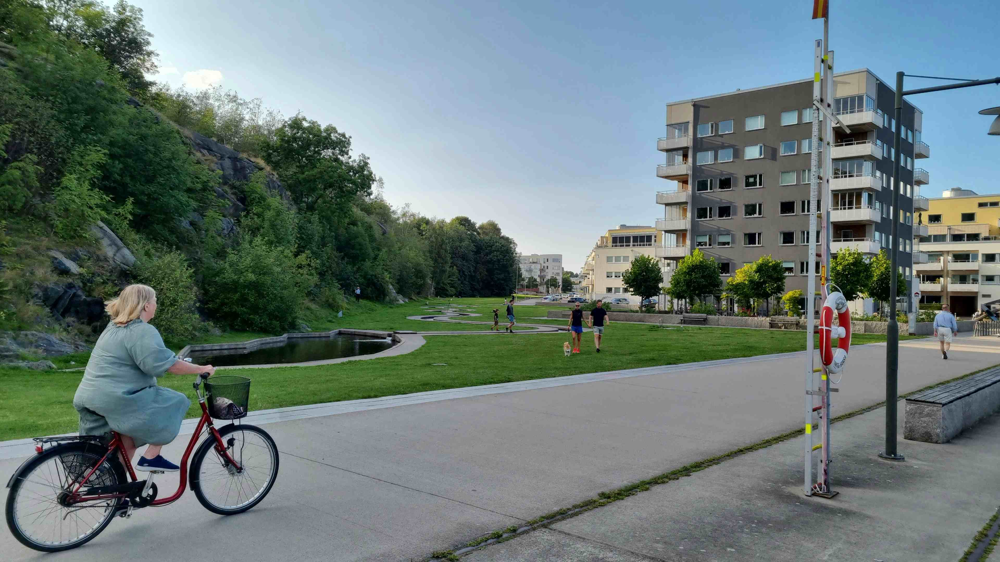

# 城市绿野中的日常诗行

阳光如薄雾般轻笼在宽阔的步行道，洒落在葱郁绿林与错落建筑之上，为这白日景象晕染出温柔的光影层次。浓密的枝叶似跳动的翡翠，在风的轻抚下漾开蓬勃生机，将满满的春意与活力晕染在空间每一处角落。棕褐调的建筑静静伫立，玻璃窗凝着天空与叶影的轻吻，光影在墙面与步道间轻舞，明亮日光让绿意愈发鲜亮，建筑色彩愈发温润，每一寸空间都流淌着生活的气息。步道上行人步履轻缓，有人悠然骑行，他们的身影融入了自然与人文交融的画面；远处草坪上的身影、环绕的水域，与林木、建筑共同构成错落有致的和谐景致，构图间尽显空间舒展与生命活力。

这处景象，实则是城市在地理与人文脉络中对平衡的深情注脚。建筑与现代规划理念相映成辉，与周边山体、茂林共生，既见证了城市发展回归自然的智慧，也诉说了一处老城区经过生态改造后，历史肌理与现代生活悄然相融的历程。人们在此行走、休憩，是城市文明的温柔缩影；而绿树成荫的步道、错落有致的建筑，又诉说着人与自然共生的哲学，每一缕风过林梢、每一抹翠色映楼，都是时光在土地上悄悄抚过的温柔絮语，让这一方天地成为城市里滋养人心的诗意秘境。