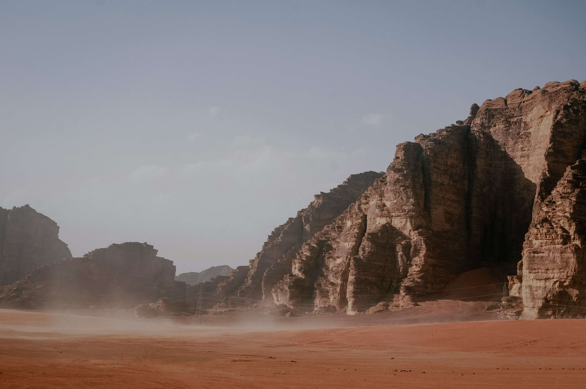

# 棕岩与晨光的脉络  
白昼的光线如温柔的笔触，为这片棕岩群山泼洒出层次纷繁的韵律。岩石以暖棕与赭褐交织的色彩，在阳光的晕染下，肌理深浅交错，宛如岁月镌刻的立体史诗。近处岩壁粗粝苍劲，层理如时光褶皱层层堆叠，每道沟壑都盛满地质历史的私语；远山在淡青色天际渐次晕开，化作朦胧的剪影，与天空轻拥成悠远的轮廓。沙地如暖烘烘的赤色绒毯，与岩石的挺拔棱角形成强烈对比，光影在沙面上描摹出朦胧韵律，尘土轻扬时，给天地蒙上薄纱般的诗意，让远山近岭都染上缥缈的诗意质感。  

这般地貌，是地质与岁月对话的载体。千万年风化与侵蚀的雕琢，将岩石塑造成这般雄浑姿态，而此地过往或许承载水域（即便当下呈现干旱景象），暗示这片土地曾以水域与绿洲的温情拥抱岁月，人文与自然的脉络在此处交织生息。先民的足迹或许曾踏过岩间，岩石以沉默姿态见证时光变迁，光影与山水的共鸣，仍是不变的精神章句，承载着自然与人文交织的温柔记忆。