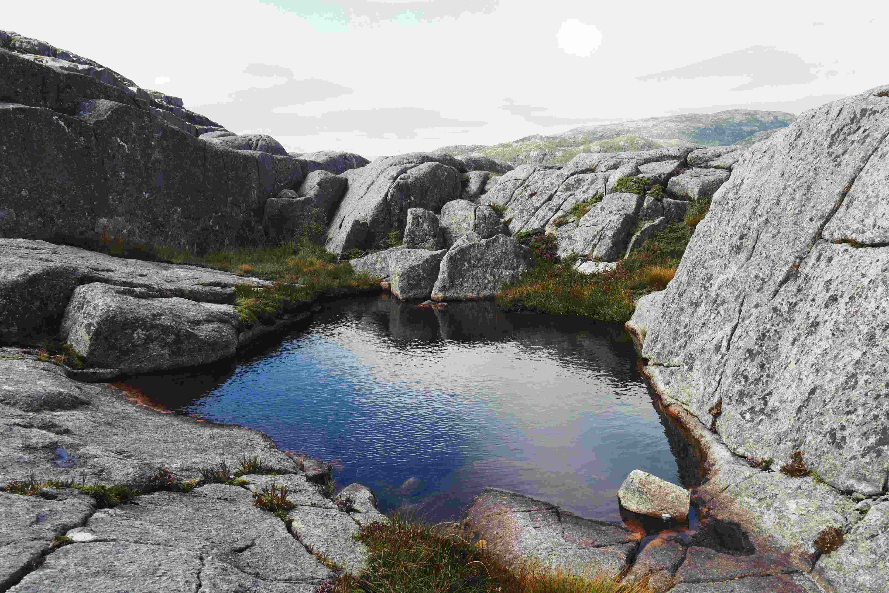

# A Small Pond Nested Among the Stones

银灰色的巨岩在天地间静静伫立，如沉默的古者。小池塘似一块澄澈的宝石，被岩石环拥而成。光线轻柔地洒落，在岩石的褶皱间漾开温柔的光斑，仿佛时光在此处减缓了步调。岩石以冷硬的灰调为主，布满岁月雕琢的纹路，与水面如镜的蓝形成鲜明又和谐的对照。池塘的蓝色如深遂的天空融于水中，周边岩石缝隙间，斑驳的绿意与草木倔强生长，为这片冷硬的空间添了几分蓬勃的暖意。  

这片天地是自然与时间的共同杰作——岩石的沟壑与纹理，是冰川、水流与岁月持久雕琢的印记；小池塘则是千万年雨水汇聚而形成的灵动秘境。从地理与文化交织的视角看，此景不仅是自然造物的奇迹，更承载着人与土地的深度羁绊。古老的居民或许曾将此处视为生存根基，引水而居，或将其当作自然敬畏的圣殿；而它也见证了地质变迁与文化积淀将持续的心跳。水面如镜，映着岩石的刚毅与天空的温柔，恰如自然与人文在时光中寻找平衡的那份沉静与庄重，每一道石纹、每一汪水痕，都是自然与人间情愫交融的注脚。