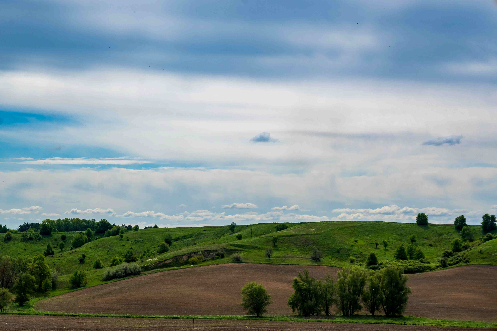

# A Field With Trees and a Hill in the Background

天空如晕染的蓝调长卷，轻薄云絮在风里舒展，将光影一寸一寸轻铺在大地。远处的山峦被绿意温柔环绕，起伏的草坡如温软的琴键，每道沟壑都载着风的轨迹。近景的田野，深棕与翠绿交织如大地绘就的色彩，树木或聚或散，在坡地与平川间构成灵动的轮廓，枝叶承接天空的温柔私语，也守护着田野的静谧。  

光影在这片天地间流转，明与暗在绿意里舒展，云层漏下的光把空气晕成澄澈的通透，每一寸空间都流淌着自然与宁静。这样的画面，是地理与文化的共生诗行——古老土地承载着岁月沉淀的耕作智慧，树木栽种源于对生态的敬畏与生活需求的依存，远山的轮廓诉说着地质变迁与世代守护的故事。当风穿过树林，拂过起伏的坡地，我们触摸到岁月的脉搏：曾有多少农人循着季节节奏，在田埂间丈量时光；又有多少文化基因，在绿意与光影里悄然传承。  

这片田野、树木与远山的组合，不止是视觉上的温柔馈赠，更是人类与土地共生共荣的鲜活注脚，每一棵树、每一道山影，都藏着地理文明与自然对话的深邃故事，温柔诉说着永恒的和谐与传承。