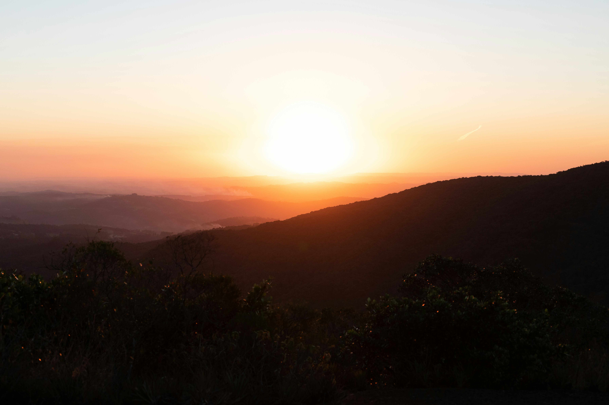

# Silhouette of Mountains

夕阳在山峦后轻轻晕开一片炽烈的橙红，将天际裁成温柔的渐变。画面里，连绵的山峦化作深黑色的剪影，在暖调霞光中灵动而静谧。光影如轻柔的纱幕，悄然笼罩山峦，近处的植被在暗色轮廓里泛着微光，远处的山峦被霞色轻柔晕染，朦胧得近乎传说。色彩从橙红到淡蓝的过渡，宛如自然精心调配的调色盘，每一缕色调都在空气里漾开柔和的光晕，构图如天然的乐章，层次交错间满是和谐与诗意。

这山峦的剪影背后，是地理与文化交织的史诗。它们沉默地伫立着，是区域生态系统的心脏，调节着气候、滋养着生机；在人类文明的脉络里，是先民迁徙时永恒的指北针，亦是精神图腾的载体。许多古老文明都以山为灵境，登山、祈福等文化习俗在此世代流传，山脉成为自然与人文千年对话的纽带，承载着跨越世代的故事与信仰。

当最后一缕霞光隐入山海深处，那份沉默的壮美仍余韵悠长。山峦的剪影是自然艺术的巅峰绽放，更是地理格局与文化传承的注脚，让我们在光影与山脉的交融中，读懂大地深处的诗意与沧桑，以及自然与人文千年的温柔絮语。