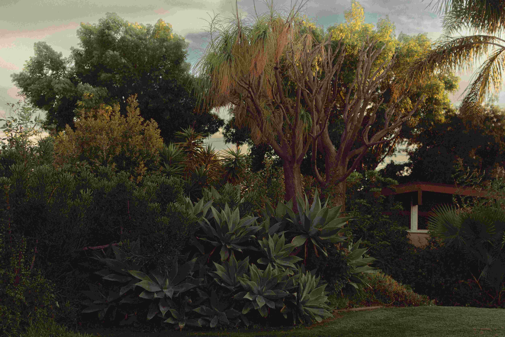

# A Bench in the Heart of a Lush Green Park  
在这片繁茂翠绿的空间里，时光仿佛被轻轻按下了慢放键。柔和的光影如温柔的脉络，透过错落的枝叶，在草地上晕染出斑驳的光影拼图，光影的交织让整个空间充满灵动的呼吸感。色彩是自然织就的华服，从深郁的墨绿灌木到泛着暖金光泽的树冠，再到那株枝条似有尘灰沉淀的特立树干，不同色调的植物相互映衬，构建出一幅层次丰富、生机盎然的画面。构图如自然自身的艺术表达，低矮的灌木与高大的乔木相互穿插，灌木丛的茂密与乔木的舒展形成视觉上的张弛，整体呈现出一种平衡而和谐的自然肌理。  

这方绿意的心脏，暗藏着地理与文化的深厚故事。它无疑是一处城市中的自然绿洲，是人们从中撕裂的喧嚣生活与蓬勃自然相融的港湾。繁茂的植被不仅呈现着生态的生命力，更承载着当地文化对"慢时光"的崇尚——每一个叶片间隙、每一丛绿意之间，都可能是晨读的角落、午后小憩的席位，而长椅的存在，正是将人与自然的联结变得触手可及。这片绿地的设计，反映着区域发展中兼顾生态保护与人文功能的目标，是自然景观与人文精神交织的文化符号。当人们在此休憩时，不仅是亲近了自然，更是与城市的历史脉络、文化心境进行了一种深度的对话。这片绿意空间，既是自然生命的绚烂展演，也是地域共同体对生活美学与精神滋养的温柔注解，每一寸绿意都流淌着人与自然和谐共生的诗意，每一道光影都映照出文化中对宁静与活力的平衡追求。