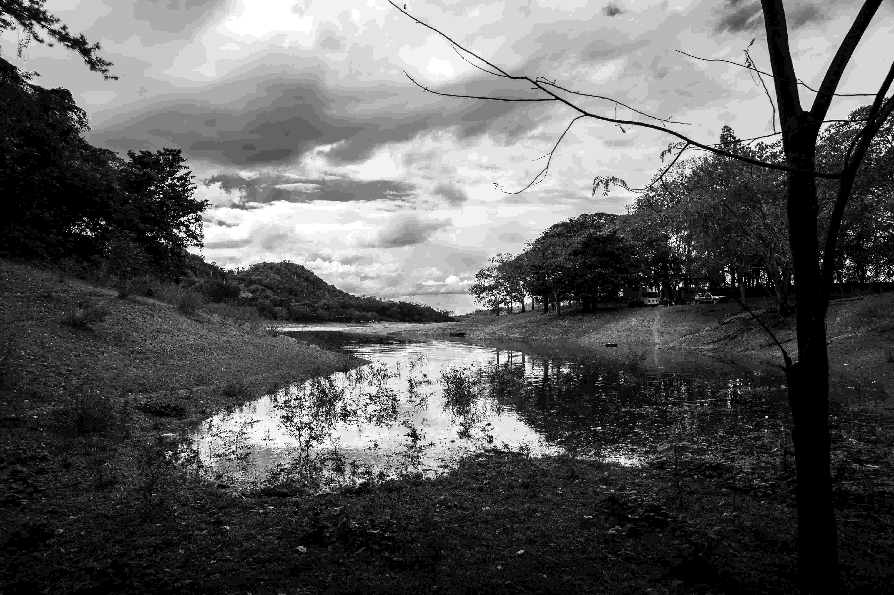

# Black and White Lake  

黑白滤镜为这片水域铺展了一层时光的薄纱，湖面如镜，细致地映出天空的云絮与岸边密林的轮廓。光影在由黑、白、灰构成的色调里交错，暗处似午后树荫，轻覆在岸畔的草坡与枯枝之上；亮处若晨露初凝，在水面漾起精致的涟漪，为画面晕开温柔的诗意。  

遥望远方，山丘如深邃的墨印，印在云层与湖水相接的地方，成为天地静默的注脚。湖畔树木的枝桠向两侧舒展，构成自然的框架，将湖泊拥入宁静的空间。黑白构图中，没有色彩的纷繁，却增添了时光的纵深——这水面承载着岁月的留痕，也承载着这片土地的文化脉络。  

这片湖泊身处的地理，或许是人类与自然共生过的地方，水域曾是原住民世代劳作、祈求灵性的场域；而黑白影像，更像时光留下的底片，记录着地理变迁与文化记忆的交融。风掠过湖面，树叶沙沙，似在诉说这片土地的过往：当人类脚步与自然韵律在此共鸣，湖泊便成为一座无声的博物馆，藏着地理的纹理，也藏着文化的厚重。那片黑白交织的湖光，既是自然的馈赠，也是时光与人文共酿的故事，诉说着人与水共生的岁月长流。