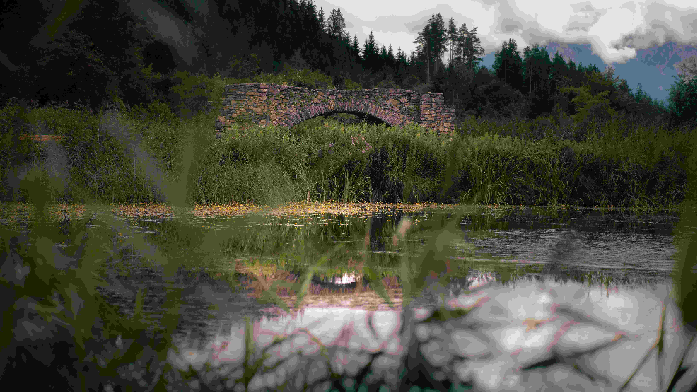

# A Lake with a Bridge in the Background

湖面如一块宁静的绿绸，轻柔地托着石桥的倒影。石桥以古朴的石块构筑，斑斓的色泽与纹理，似岁月在石缝间悄然构建故事。芦苇与野花在岸边蓬勃生长，如自然的织锦般环绕桥身，为石桥添了勃勃生机。光影如纤薄的纱，在湖水与石壁间缠绵，将彩色石桥的轮廓晕染成怀旧又柔和的色调。天空的云影低垂，为整个画面蒙上朦胧的诗意，风里似还飘着草木的气息。  

石桥的青石见证过多少水波与时光，它目睹着湖水起落变迁，也承载着当地人文与自然的历史。这里，湖水滋养着生态，石桥连接着文明，自然与人文在此交融，演绎着人与环境共生的哲学。石桥不仅是物理的建筑，更是文化记忆的纽带，它见证了交通与生活的脉络，成为地理与文化交融的见证者。  

在这方天地，每一道光影、每一抹色彩、每个结构细节，都在诉说时间与自然的默契对话。当伫立在湖光与桥影之间，可触摸到地理褶皱里的文化脉络，感知到人与自然共生的温柔与厚重。即便岁月流转，这份自然与人文的交融，仍会在风、水、石间永远闪烁光芒，成为光影与时光留给世人的温柔注脚。