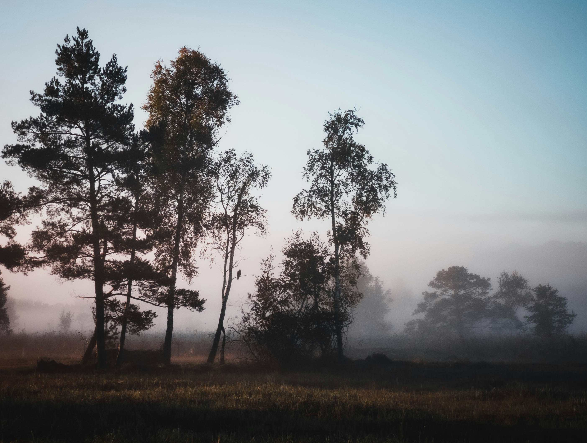

# Early in the Morning

清晨的雾如轻柔的纱幕，悄然覆于这片林木之上。当第一缕晨光悄然浮现，柔和的光影便开始缠绕着高大树木，将它们的轮廓晕染得仿若古老壁画里留下的遗影。天空在渐变的光线中，晕染着浅蓝与粉紫的交织，宛如自然是位温柔的调色师，正以最轻柔的笔触划分昼夜的界线。树木的剪影在薄雾中若隐若现，针叶与阔叶的层次，如同时间在其叶隙间刻下的纹路，扎根于这片土地的肌理之中。草地泛着暗沉的棕黄，又被晨雾浸染成朦胧的灰色调，每一处色彩都像是自然在向旧日告别、向新生拥抱时的叹息与雀跃，共同谱写着黎明前特有的宁静乐章。

这片初醒的景致，背后暗藏丰厚的地理文化故事。此地为温带森林与湿地交织的生态过渡地带，晨雾源于夜间气温降低使水汽凝结，这是特定的地貌与气候共同作用的结果。在当地文化脉络中，这样的清晨常被赋予灵性内涵——原住民或守护自然的群体，常将早间的霞光视为自然力量的唤醒信号，而在这雾霭弥漫的时刻，树枝间或许藏有雀鸟的啁啾，那是生命与土地共震的悠扬乐章。高大树木的沉默、雾霭的悠扬，构成了一曲关于时间与荒野的诗，诉说着大地在晨昏交替时呼吸的模样，也见证了人类文明与自然生态在千万年里的静默契约，每一缕晨光都承载着土地的历史与生命的期许。