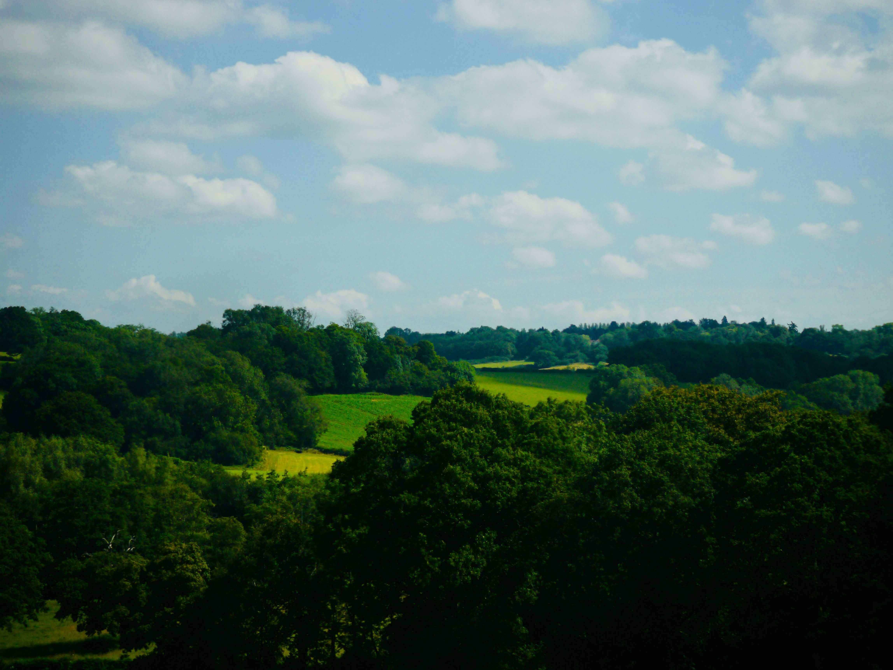

# Green Trees Under White Clouds and Blue Sky During Daytime  

阳光如温柔的开章者，在浓翠似染的天地间轻铺展。画面里，深浅交织的绿树层层叠叠，似自然精工编织的翡翠幕帘，从前景缓缓延伸至远景，每一片叶尖都凝聚着蓬勃的生命律动。澄澈的蓝天如洗练的釉色，棉絮般的白云零星散落，在光与影的轻抚下，边缘晕开柔和的淡色，将天空衬得格外澄澈明亮。光影在此处是灵动的笔触，为翠绿的肌理勾勒出明暗层次，让每一片树叶都漾着阳光的温度，似在低诉自然的呼吸与心跳。  

远处那片黄绿交织的田野，如田园诗中舒展的温柔缎带，这片景观的构图如天然的画卷，层次分明却又浑然一体，让人仿若置身于自然与心灵的边界，触摸到天地共生的脉搏。而背后，这片生机盎然的土地，藏着地理与文化的千年默契——或许是古时滋养水土孕育出满山的蓬勃，或许是田园文明脉络在此延续，让自然景观成为人文精神的载体。阳光、云霭与青翠交织成时光的注脚，既是一场视觉上的诗意盛宴，也是人与自然共生关系中岁月沉淀的故事，在光影流转间，诉说着地理风貌与文化底蕴的永恒交融。